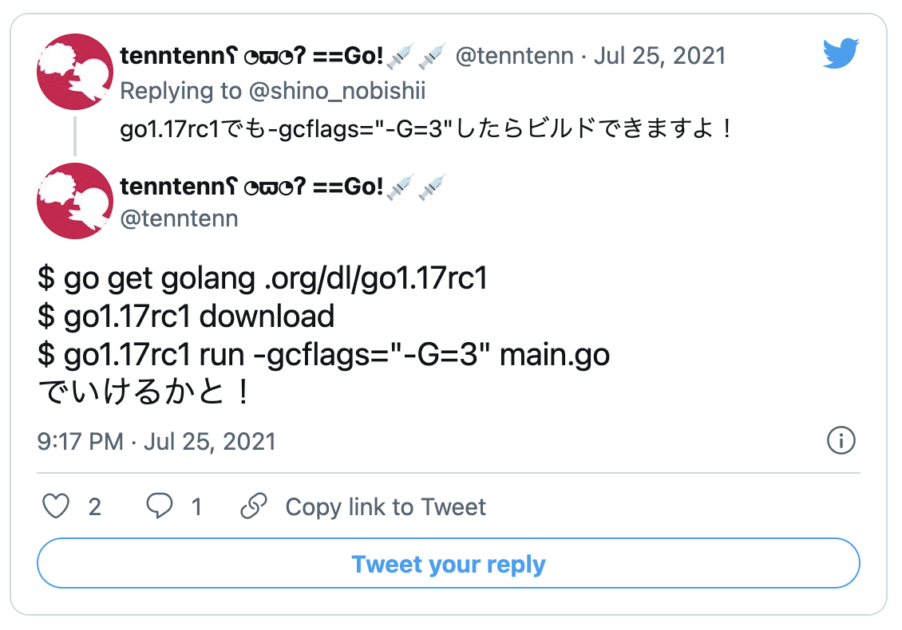

# フラグ付きのGo 1.17でGenericsはどこまで動くのか

## syumai

### Go 1.17 リリースパーティー

---

<div style="display: flex; flex-direction: column; align-items: center">

## なんと、Go 1.17 RC1でも一部Genericsが動いていた


</div>

---

## Go 1.17のリリース後に同じフラグ付きで実行したらなんと動いた

---

これで動きます

```sh
go install golang.org/dl/go1.17@latest
go1.17 download
go1.17 run -gcflags="-G=3" main.go
```

---

## どこまで動くか試してみる

---

## 確認したいもの

1. Type Parameters
   - 型宣言
   - 関数宣言
   - 型推論
2. Interface
   - 事前宣言されたconstraints
     - any, comparable
   - type list (type sets proposalで廃止)
   - type set
3. 標準package
   - constraints
   - slices
   - maps

---

## 注意

* 簡単に試しただけの内容なので、正確でない可能性があります
* 動くからといって、業務に使うと今後の仕様変更で動かなくなる可能性が高いです

---

## Interface => 標準package => Type Parameters の順で検証します

---

### Interface
  - 事前宣言されたconstraints
    - any, comparable
  - type list (type sets proposalで廃止)
  - type set

---

### 標準package
  - constraints
  - slices
  - maps

---

### Type Parameters
  - 型宣言
  - 関数宣言
  - 型推論
    - Function type inference
    - Constraint type inference

---

# 結果

---

## 仕様としては古いものの、それなりに動いた

---

# おまけ

---

## Genericsの開発branchの内容がmasterにマージされたらしい

---

これで最新のmasterの実装内容が動きます

```sh
go install golang.org/dl/gotip@latest
gotip download # masterをdownloadしてくれる
GOEXPERIMENT=unified gotip run main.go
```

`GOEXPERIMENT=unified` はzcheeさんに教えてもらったtenntennさんに教えてもらいました

---

## 最新のmasterではtype setも動きました！

---

ご清聴ありがとうございました
