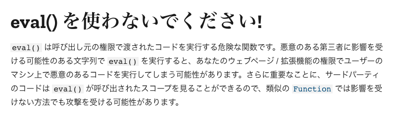

# iframe sandboxでユーザー入力スクリプトを実行する

## syumai

### フロントエンドLT会 - vol.4 (2021/9/15)

---

# 自己紹介

## syumai


普段はTypeScript (React / Next.js) やGoを書きつつ生活しています

Twitter: [@__syumai](https://twitter.com/__syumai)
Website: https://syum.ai

---

# 本日のテーマ

---

## iframe sandboxでユーザー入力スクリプトを実行する

---

# 元々何がしたかったのか？

---

## ユーザーが入力したJavaScriptを**安全に**実行したかった

---

## 本発表における `安全` の定義とは？

---

## 前提

* 提供するアプリケーション上で、ユーザーが、自身の書いたスクリプトを**自身のページ内**で実行することを出来るようにしたい
  - 不特定多数の目にスクリプトが触れるような使い方はしない

---

## 本発表における `安全` の定義

* **アプリケーションの動作が破壊されないこと**
  - ユーザー入力スクリプトを実行することで、提供するアプリケーションのDOMが変更されない
  - アプリケーションの状態の変更が行われない
    - => localStorage / sessionStorageなどの内容の書き換えが発生しない

これが満たされないと、ユーザー入力スクリプトの内容によってアプリケーション全体をクラッシュさせることが可能になる

---

## 実行したいスクリプトの例

---

## 実行したいスクリプトの例

* 下記のようなObjectの加工を行って、結果を画面に表示したい

**加工前のObjectを保持する変数**
```js
const data = { a: 1, b: 2, c: 3 };
```

**ユーザー入力スクリプト**
```js
{ a: data.a, c: data.c * 2 }
```

**表示**

<small>
<table>
<thead>
  <td>key</td>
  <td>value</td>
</thead>
<tr>
  <td>a</td>
  <td>2</td>
</tr>
<tr>
  <td>c</td>
  <td>6</td>
</tr>
</table>
</small>

---

<font color="red">**ユーザー入力スクリプト**</font> **←ここをどう実行するかを考える**
```js
{ a: data.a, c: data.c * 2 }
```

---

その上で、下記のような入力が**アプリケーションを破壊しない**ようにする
```js
document.write("kaboom!💣"); // 画面上に `kaboom!💣` だけが表示される
```

```js
window.localStorage.clear(); // localStorage内の全データを消す
```

---

## 調べたこと

1. ユーザー入力スクリプトを実行する方法
2. ユーザー入力スクリプトの実行を安全に行う方法

---

# 1. ユーザー入力スクリプトを実行する方法

---

## 方法は2つ

1. eval
2. Function() constructor

---

# eval

---

## evalの使い方

* 式、または文 (および複数の文) を渡すと、それを評価して結果を返す

```js
const a = 2;
const b = 3;

eval("a * b"); // => 6 (式の評価)
eval("a * b; a + b"); // => 5 (文の評価)
```

---

## evalの特徴

* スコープを引き継ぐ
  - evalが呼ばれた箇所のローカルスコープを引き継ぐ
    - 危険: 本来使って欲しくない変数まで使えてしまう
    - 低速: eval中で使われる変数名などをバイトコード中から探すため

```js
// 与えられたObjectを `query` で変形する関数
function transformObject(obj, query) {
  const __SECRET_FUNCTION = () => console.log("kaboom!💣");
  return eval(`(${query})`);
}

const data = { a: 2, b: 3 };
console.log(
  transformObject(data, "{ a: obj.a * 2, b: obj.b * 2 }") // => `{ a: 4, b: 6 }`
);
console.log(
  transformObject(data, "__SECRET_FUNCTION()") // => `kaboom!💣`
);
```

---

## MDNより



https://developer.mozilla.org/ja/docs/Web/JavaScript/Reference/Global_Objects/eval

---

# Function() constructor

---

## Function() の使い方

* 新たな関数を生成する
* 引数名の一覧と、関数のbodyを渡して使う

```js
const a = 2;
const b = 3;

const sum = new Function("x", "y", "return x + y;");
sum(a, b); // => 6

// `new` を書かなくても同様に使える
const sum2 = Function("x", "y", "return x + y;");
```

---

## Function() の特徴

* 関数の生成に伴って、新たなスコープが切られる
  - 本来使って欲しくない変数が使われることがない

```js
// 与えられたObjectを `query` で変形する関数
function transformObject(obj, query) {
  const __SECRET_FUNCTION = () => console.log("kaboom!💣");
  const transform = new Function("obj", `return (${query});`);
  return transform(obj);
}

const data = { a: 2, b: 3 };
console.log(
  transformObject(data, "{ a: obj.a * 2, b: obj.b * 2 }") // => `{ a: 4, b: 6 }`
);
console.log(
  transformObject(data, "__SECRET_FUNCTION()") // => `Uncaught ReferenceError: __SECRET_FUNCTION is not defined`
);
```

---

## ユーザー入力スクリプトへのstrict modeの適用

* strict modeの適用も出来る

```js
// 与えられたObjectを `query` で変形する関数
function transformObject(obj, query) {
  const __SECRET_FUNCTION = () => console.log("kaboom!💣");
  const transform = new Function("obj", `"use strict"; return (${query});`);
  return transform(obj);
}

const data = { a: 2, b: 3 };
console.log(
  transformObject(data, "with({ x: 100 }) { x }") // => `Uncaught SyntaxError: Unexpected token 'with'`
);
```

---

# (本発表の定義において) Function() は安全か？

---

## 本発表における `安全` の定義 (再)

* **アプリケーションの動作が破壊されないこと**
  - ユーザー入力スクリプトを実行することで、提供するアプリケーションのDOMが変更されない
  - アプリケーションの状態の変更が行われない
    - => localStorage / sessionStorageなどの内容の書き換えが発生しない

---

## Function() はこれを満たすか

* ユーザー入力スクリプトを実行することで、提供するアプリケーションのDOMが変更されない
  - => **変更できる**
    - window Objectを参照可能なので、globalに行える操作は何でもできる
    - 自由にDOMを追加したり、操作したりできる
* アプリケーションの状態の変更が行われない
  - => **変更できる**
    - アプリケーションと同じページ上のscriptとして動作するので、localStorage / sessionStorageなどを自由に書き換えできる

=> **満たしていない**

---

# 2. ユーザー入力スクリプトの実行を安全に行う方法

---

# どうすれば安全にできるか？

---

## どうすれば安全にできるか？

* ユーザー入力スクリプトを実行することで、提供するアプリケーションのDOMが変更されない
  - window Objectを参照可能なので、globalに行える操作は何でもできる

---

## どうすれば安全にできるか？

* ユーザー入力スクリプトを実行することで、提供するアプリケーションのDOMが変更されない
  - window Objectを参照可能なので、globalに行える操作は何でもできる
    - <font color="red">**window Objectを参照できないようにすれば、DOMを操作できなくなる**</font>

---

## どうすれば安全にできるか？

* アプリケーションの状態の変更が行われない
  - アプリケーションと同じページ上のscriptとして動作するので、localStorage / sessionStorageなどを自由に書き換えできる

---

## どうすれば安全にできるか？

* アプリケーションの状態の変更が行われない
  - アプリケーションと同じページ上のscriptとして動作するので、localStorage / sessionStorageなどを自由に書き換えできる
    - <font color="red">**localStorage / sessionStorageなどを参照出来ない場所でscriptを実行する**</font>

---

- window Objectを参照できないようにすれば、DOMを操作できなくなる
- localStorage / sessionStorageなどを参照出来ない場所でscriptを実行する

これらを満たすには？
結論として、<font size="48"><b>別Originでscriptを実行すればOK！</b></font>

---

# Same-origin policy

---

## Same-origin policyとは

MDNより

> **あるオリジンによって読み込まれた文書やスクリプトが、他のオリジンにあるリソースにアクセスできる方法を制限するもの**です。

https://developer.mozilla.org/ja/docs/Web/Security/Same-origin_policy

---

## Originとは

eijiさんの記事より

> Origin は scheme (http とか　https とか)、hostname、port の組み合わせを指す。same-origin と言った場合、これらすべてが一致するものを示している


same-site/cross-site, same-origin/cross-originをちゃんと理解する: https://zenn.dev/agektmr/articles/f8dcd345a88c97

---

## Same-origin policyによってアクセスが制限されるもの

* iframe、window.openなどによって得たwindow Objectのプロパティ (一部除く)
* Access-Control-Allow-Originヘッダが設定されていないリソースへのfetch / XHR

など

---

## Same-origin policyによってアクセスが制限されるもの

* <font color="red">iframe、window.openなどによって得たWindow Objectのプロパティ (一部除く)</font>
  - 今回関心があるのはこちら

---

## Window Objectの参照とは?

* iframe, window.openなどで得られる

例

| 経路                      | 親 => 子             | 子 => 親      |
| :------------------------ | :------------------- | :------------ |
| iframe                    | iframe.contentWindow | window.parent |
| window.open(url)          | open関数の返り値     | window.opener |
| `<a ... target="_blank">` | -                    | window.opener |

---

## Window Objectを経由したプロパティアクセス

同一Originの例
* https://a.example.com/index.html に https://a.example.com/iframe.html を埋め込む

**https://a.example.com/index.html のHTML**

```html
<iframe src="https://a.example.com/iframe.html">
</iframe>
```

**https://a.example.com/iframe.html のHTML**

```html
<script>
  window.parent.document.write("kaboom!💣");
</script>
```

=> https://a.example.com を表示すると、 `kaboom!💣` と画面に表示される

---

## Window Objectを経由したプロパティアクセス

別Originの例
* https://a.example.com/index.html に https://b.example.com/iframe.html を埋め込む

**https://a.example.com/index.html のHTML**

```html
<iframe src="https://b.example.com/iframe.html">
</iframe>
```

**https://b.example.com/iframe.html のHTML**

```html
<script>
  window.parent.document.write("kaboom!💣");
</script>
```

=> **例外が発生する**。内容: `DOMException: Blocked a frame with origin "https://b.example.com" from accessing a cross-origin frame.`

---

## Window Objectを経由したプロパティアクセス

* ごく一部を除いて、基本全てのプロパティへのアクセスが禁じられる
  - **ユーザー入力スクリプトを実行することで、提供するアプリケーションのDOMが変更されない** と言う条件を満たすのに使えそう！
* localStorage / sessionStorageへのアクセスも禁じられる
  - **アプリケーションの状態の変更が行われない** と言う条件を満たすのに使えそう！


---

## Same-origin policyを踏まえた実装方針

**別OriginのWindow Objectを入手して、その中でscriptを実行すること**
に決定

---

# 実装

---

## やること

1. 別OriginのWindow Objectを入手する
2. `1` のWindowにユーザー入力スクリプトを渡して実行する
3. 実行結果を入手する

---

# 1. 別OriginのWindow Objectを入手する

---

## iframe sandboxを使う！

* iframeにsandbox属性を設定すると、iframeの機能を制限できる
* sandbox属性を使うと、iframe内は特殊なOrigin (`null`) として、**常にSame-origin policy**に失敗させられる
  - 同一Originからiframeのコンテンツを配信しても安全に出来る

```html
<iframe src="xxx" sandbox></iframe> <!-- 全て不許可 -->
<iframe src="xxx" sandbox="allow-scripts"></iframe> <!-- JavaScriptの実行のみ許可 -->
```

* sandbox属性はホワイトリスト形式
  - デフォルトは全て不許可
  - 実は、 `allow-popups` や `allow-modals` なども存在する
    - 入力スクリプトによる `window.alert` などの実行をセットで防げる

---

## 危険！ allow-same-origin

* `allow-same-origin` を指定すると、通常の Same-origin policy が適用され、同一Originだった場合 **iframe内から親WindowのDOM操作などが可能になる**
  - そもそもsandbox属性の内容も書き換えられるし、何でも出来ちゃう
  - 今回の用途では絶対にNG

```html
<iframe src="xxx"
  sandbox="allow-scripts allow-same-origin"></iframe> <!-- 要注意！ -->
```

---

## 実装

* execScript関数を作る
  - その中でiframeを生成する形にする

```js
function execScript(script) {
  const iframe = document.createElement("iframe");
  iframe.sandbox = "allow-scripts";
  iframe.contentWindow // 別OriginのWindow Objectが入手できた！
  ...
}
```

---

# 2. `1` のWindowにユーザー入力スクリプトを渡して実行する

---

## WindowのpostMessageを使う！

* Cross originではWindow Objectのプロパティアクセスが基本的に不可能
* `postMessage(message, targetOrigin)` を使ったmessageの送受信は可能

iframeの例

**親Window** (https://a.example.com)

```js
const iframe = ...
iframe.contentWindow.postMessage({ message: "hello!" }, "https://b.example.com");
```

**子Window** (https://b.example.com)

```js
window.addEventListener("message", (event) => {
  console.log(event.data); // `{ message: "hello!" }`
})
```

---

## postMessageの注意点

* 受信側が、**どこからmessageを受け取るか選べない**
  - `message` イベントハンドラが複数Window Objectからの受信に対して共通になる
  - origin / sourceのチェックは必須

```js
window.addEventListener("message", (event) => {
  // https://a.example.com から受け付けたmessageしか処理しない！
  if (event.origin !== "https://a.example.com") {
    return;
  }
  // iframeの親Windowから受け付けたmessageしか処理しない！
  if (event.source !== window.parent) {
    return;
  }
  ...
});
```

---

## 実装

```js
function execScript(script) {
  ...

  iframe.srcdoc = `
  <script>
  window.addEventListener("message", (event) => {
    if (event.origin !== "${window.location.origin}") {
      return;
    }
    if (event.source !== window.parent) {
      return;
    }
    // 受け取ったscriptの実行
    const fn = new Function(event.data.script);
    // 結果を返す
    window.parent.postMessage({ result: fn() }, "${window.location.origin}")
  });
  </script>
  `;

  // ユーザー入力スクリプトをiframeに送信する
  // `*` を指定するのは、`null` originにmessageを送るため
  iframe.postMessage({ script }, "*");

  ...
}
```

<small>
※) 本当はiframeがmessageを受信出来る状態になるまで待つ必要がありますが、ここでは省略します
</small>

---

# 3. 実行結果を入手する

---

## 実装

* `2` で結果を返すところまで実装したので、あとはそれを受け取るだけ

```js
function execScript(script) {
  ...

  window.addEventListener("message", (event) => {
    // `null` originからの受信になる。ここのチェックは一旦skip
    // if (event.origin !== "null") {
    //  return;
    // }
    if (event.source !== iframe.contentWindow) {
      return;
    }
    console.log(event.data); // 結果が入手できた！
  });
}
```

---

# 実装の工夫

---

## Promiseを使う

* どうしても非同期になってしまうので、Promiseで結果を取得できるようにする

```js
function execScript(script) {
  ...

  return new Promise(resolve => {
    window.addEventListener("message", (event) => {
      if (event.source !== iframe.contentWindow) {
        return;
      }
      resolve(event.data);
    });
  }
}
```

---

## 引数を指定できるようにする

```js
// args Objectを受け付ける
function execScript(script, args) {
  ...

  iframe.srcdoc = `
  <script>
  window.addEventListener("message", (event) => {
    ...
    const { script, args } = event.data;

    // args Objectをkeyとvalueの配列に分解する
    const keys = Object.keys(args);
    const values = Object.values(args);

    // argsをFunction constructorに渡す
    const fn = new Function(...keys, script)(...values);

    window.parent.postMessage({ result: fn() }, "${window.location.origin}")
  });
  </script>
  `;

  iframe.postMessage({ script, args }, "*");

  ...
}
```

---

## 完成！

```js
const a = 2;
const b = 3;

await execScript("a * b", { a, b }); // 6
```

---

# デモはこちら

https://github.com/syumai/sandboxed-eval


---

# まとめ

* ユーザー入力スクリプトの実行でアプリケーションの動作を破壊されないようにするには、別OriginのWindowが使える
* 別OriginのWindow Objectを入手するには、sandbox属性を設定したiframeを使うのが都合が良い
* Window Object間のmessage 送受信にはpostMessageが使える

---

# 終

---

# 補足

---

## postMessageの機能についての補足

* もし、postMessageを使って関数の送信が可能であれば、悪意を持った関数を親Windowに送って実行させることが出来ると考えられる
* これは可能か？
  - => 不可能！
  - postMessageによって送られるObjectは `構造化複製アルゴリズム` によって複製される
    - WebWorker / IndexedDBとの値のやり取り等に使われるアルゴリズムと同じ
  - このアルゴリズムでは、 **関数は複製不可能なので送信時にエラーとなる**。
  - 詳細はこちら: https://developer.mozilla.org/ja/docs/Web/API/Web_Workers_API/Structured_clone_algorithm

---

## sandbox化されたiframeで実行出来るスクリプトについての補足

* fetch / XHRは実行出来るか？
  - => 出来ます。
  - Originが `null` になるだけで、外部にリクエストは普通に送ることが出来る。
    - 今回のようなユースケースでなければ、場合によっては都合が悪い可能性がある
    - トラフィックの多いページにこのスクリプト実行機構を設置すると、意図せず外部サイトへの大量リクエストが飛ぶ可能性があるので要注意

---

## sandbox化されたiframeで実行出来るスクリプトについての補足

* iframeのメッセージ受信機構を破壊できるか？
  - => 出来ます。
    - window.locationが書き込み可能なので、iframeに表示中のページを遷移することが出来ます。
    - もし、遷移先に `message` handlerが設定されていた場合、親Windowから送信したメッセージを対象のWindowから読まれる可能性がある点に注意です。
      - 今回のユースケースでは、スクリプトの実行者はスクリプトを作成した本人となるため許容出来ます。
    - メッセージ受信機構が破壊されても機能を完全に停止させないようにするためには、(今回の実装のように、)iframeを関数呼び出しの度に生成するのがよいのではないかと考えています。
