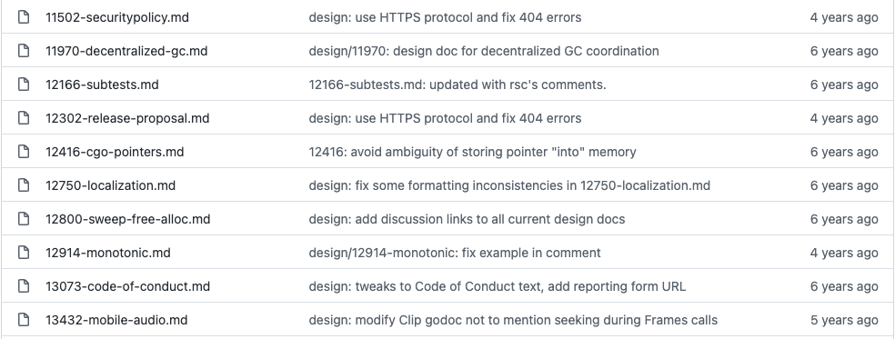
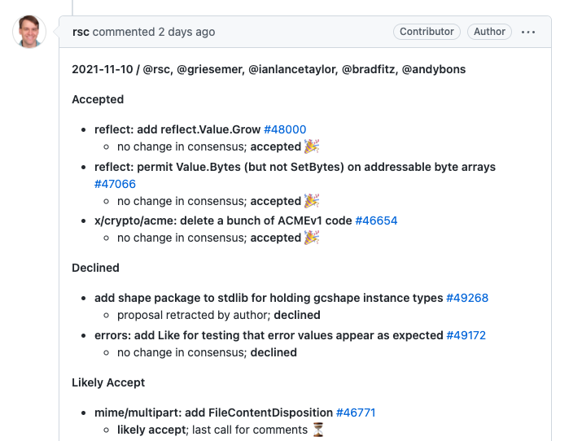
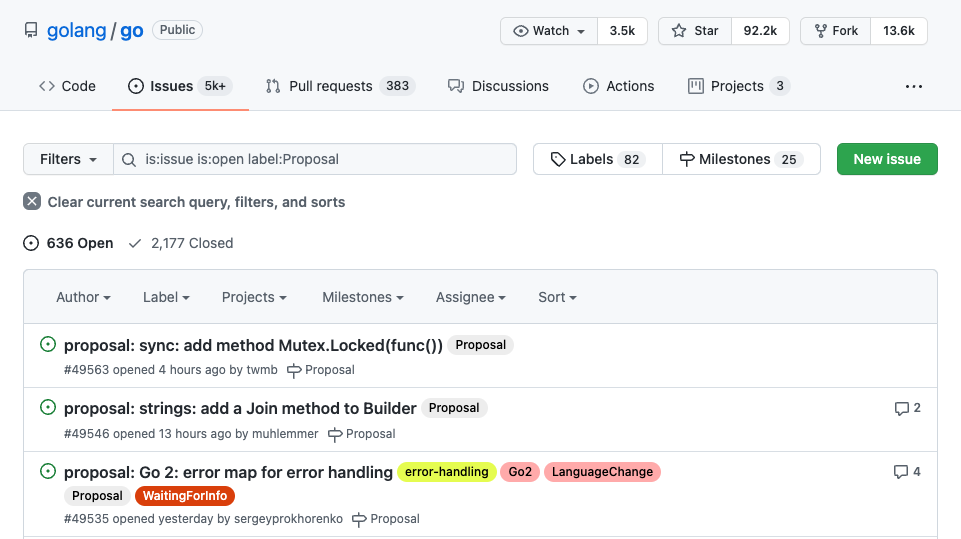
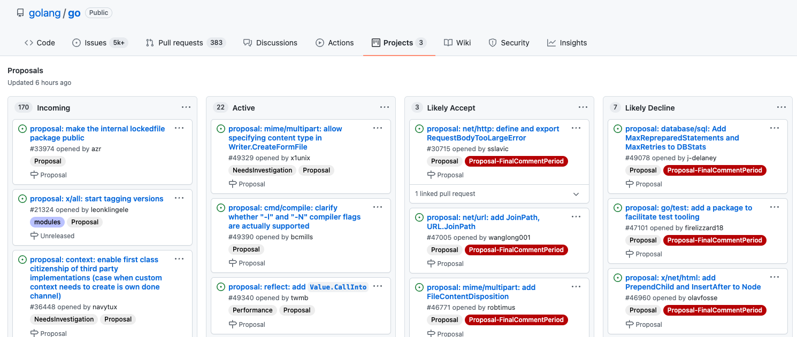
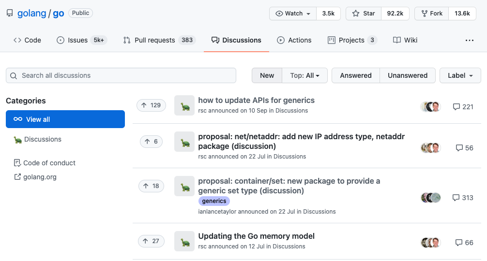

# GoのProposalの追い方ガイド

### syumai

#### Go Conference 2021 Autumn (2021/11/13)

---

# 自己紹介

## syumai

* Go Language Specification輪読会主催
* 普段はGoでGraphQLサーバー (gqlgen) や TypeScriptでフロントエンドを書いています

Twitter: [@__syumai](https://twitter.com/__syumai)
Website: https://syum.ai

---

# 話すこと

* Go の Proposal とは？
* Proposal を追うにあたって読んでおきたい資料
* Proposal の議論方法について
  - Proposal のプロセス
  - Proposal review meetings
  - Proposal のステージ
* どこを追っていけば良いのか？

---

<!-- _class: lead -->

# 本日のテーマ

---

<!-- _class: lead -->

# GoのProposalの追い方

---

## GoのProposalとは?

* Go の言語仕様や、標準ライブラリ、コマンドラインツールなどに対する提案
* golang/go リポジトリ上で GitHub Issue の形式で管理されている
* これを追っていけば、**将来の Go がどうなっていくのかいち早くキャッチアップ出来る**

---

<!-- _class: lead -->

# Proposal を追うにあたって
# 読んでおきたい資料

---

## Proposing Changes to Go

* Go の Proposal の議論方法について書かれた資料
* Proposal のステージ遷移についてや、定例 MTG についてなどもここに書かれている
* 本日の発表内容も、この記事をベースにしています

https://go.googlesource.com/proposal/+/master/README.md

---

<!-- _class: lead -->

# Proposal の議論方法について

---

## Proposal のプロセス

<small> (`Proposing Changes to Go` に記載の内容から抜粋しました) </small>

1. Proposal の著者が Issue を作成する (Design doc は不要)
2. Issue tracker 上で議論を行い、下記の3つを結果とする
   - 承認, 却下, Design doc の要求
3. (Design doc が必要な場合) Proposal の著者が Design doc を書く
4. 議論、Design doc の更新を繰り返し、下記の2つを結果とする
   - 承認, 却下

承認または却下後に、通常の contribution 同様に実装が行われる

---

### Design doc について

* Proposal の内容のみでは不足している場合に追加で提出される文書
* Proposal とは別で管理されている
  - golang/proposal リポジトリ
* ファイル名に Issue 番号を付けた Markdown の形式で投稿される

---

## Proposal review meetings

* Go に提出されている Proposal について、Go Team のメンバーが議論するミーティング
* 週次で開催されている (大体水曜)
* ここで Proposal のステージを更新する
* 議論の対象になるのは `Active, Likely Accept, Likely Decline` の Proposal
* 結果は `Proposal minutes` (https://golang.org/s/proposal-minutes) に投稿される

---

### Proposal minutes の投稿イメージ

---

## Proposal のステージ

* Incoming
* Active
* Likely Accept
* Likely Decline
* Accepted
* Declined (複数種類ある)
  - Duplicate, Infeasible, Retracted
* Hold

Issue のラベルとして付与される

---

### Incoming

* 新しい Proposal はこのステージに追加される
* 次に議論すべき Proposal として判断されたら、Review meeting で Active に移動される

---

### Active

* Review meeting での議論の中心
* この時点で、実装が試験的に始まったりもする
  - 例: https://github.com/golang/go/issues/48424
  - 実装して、使ってみて問題ないかと言うのも議論の材料になる

---

### Likely Accept / Likely Decline

* Accept / Decline 前のステージ
* ここから特に動きが無ければ、時間を置いてAccept / Declineされる

---

<!-- _class: lead -->

# どこを追っていけばいいのか？

---

## 基本的な追い方

1. GitHub Issue から探す
2. GitHub の `Proposal` Project を見る (これが楽！)
3. Proposal minutes を読む

---

### 1. GitHub Issue から探す

* golang/go リポジトリの Issues から、 `Proposal` タグ付きのものを検索する
* 最新のものを見たり、検索する分にはいいものの、推移を追うのが難しい！

---

### 2. GitHub の `Proposal` Project を見る

* https://github.com/golang/go/projects/1
* 各Proposalのステージ毎に列が分かれていて見やすい
* タグ検索も出来るので、よく `generics` で絞り込んでます

---

### 3. Proposal minutes を読む

* 大体毎週水曜に開催されているので、日本時間で木曜夜くらいに見に行けば最新のminutesが上がっています
* ステージの推移は一番わかりやすいです
  - ただ、一覧性や検索性は良くない

---

<!-- _class: lead -->

# その他のパターン

---

## Design doc の変更を追う

* たまに、 Proposal より前に Design doc が書かれるパターンがある
  - proposal リポジトリへの追加 (マージ) 自体は、Issue が投稿されて番号が確定してから
* 結局 Proposal として投稿はされるが、いち早くキャッチアップしたければこれを追うのもあり
* Gerrit の Design doc の CL 一覧
  - https://go-review.googlesource.com/q/project:proposal

---

## GitHub Discussions

* Proposal を出す前に重要な議論が上がったりします
  - Proposal の具体的な内容の議論にも使われます
* 重要な話題を見逃したくなければ時々チェックすると良さそうです

https://github.com/golang/go/discussions

---

<!-- _class: lead -->

# ご清聴ありがとうございました！
