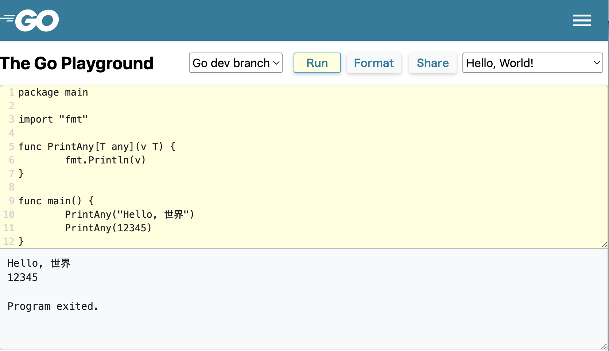

<style>
  section {
    font-family: "Helvetica Neue", Arial, "Hiragino Kaku Gothic ProN",
      "Hiragino Sans", Meiryo, sans-serif;
    padding: 50px;
  }
</style>

<style scoped>
  section {
    display: flex;
    flex-direction: column;
    justify-content: center;
  }
</style>


# What's new in Go 1.18?

### syumai

#### Go 1.18 Release Party (2022/2/18)

---

## ※注

* Go 1.18 はまだリリースされていません。
* 本発表内容は、2022年2月18日現在の情報を元にしています。
  - 発表の構成は Go 1.18 Release Notes の Draft (https://tip.golang.org/doc/go1.18) を中心に行っています。

---

## Go 1.18 の目玉機能

* Generics
* Fuzzing
* Workspace mode
* net/netip package

Generics 以外の 3 つについては、別途発表がありますのでそちらにお任せします！

---

<!-- _class: lead -->

# Generics

---

## ジェネリクス

* ジェネリックなコードを書くための **型パラメータ** (type parameters) とそれに関連した機能が追加される。
* 後方互換性が保たれているので、過去のバージョンのコードがコンパイル出来なくなることはない。

---

### 型パラメータ

* **型定義** (type definition) と **関数宣言** (function declaration) に、型パラメータを追加することが出来るようになる。


```go
// 型定義の例
type Vector[T any] []T
type Map[K comparable, V any] map[K]V // 型パラメータは複数持てる
type Pair[A, B any] struct { a A; b B } // 連続する型パラメータの制約が共通な時は省略も可能

// 関数宣言の例
func Min[T constraints.Ordered](a, b T) T {
  if a < b {
    return a
  }
  return b
}
```

---

### 型引数、 インスタンス化

* パラメータ化された型、関数の型パラメータは **型引数** (type arguments) によって置き換えられ、**インスタンス化** (instantiation) される。
  - インスタンス化の結果、新たな型、関数が生成され、それを使うことが出来ると言うイメージ。

```go
func Min[T constraints.Ordered](a, b T) T { ... }
// func Min[int](a, b int) int { ... }             // `int` への置き換えイメージ
// func Min[float64](a, b float64) float64 { ... } // `float64` への置き換えイメージ

func main() {
  fmt.Println(Min[int](1, 2))         // `T` が 型引数 `int` に置き換わる => 1
  fmt.Println(Min[float64](1.5, 0.5)) // `T` が 型引数 `float64` に置き換わる => 0.5
}
```

---

### 型推論

* 型引数は、**型推論** (type inference) のアルゴリズムによって推論可能な場合は省略することが出来る。
  - 型推論には **関数引数型推論** (function argument type inference)、 **制約型推論** (constraint type inference) の 2 種類が存在し、これらを組み合わせたアルゴリズムで動作する (ここでは踏み込んだ解説を行わない)

```go
// 関数の引数から型引数を推論する例
func main() {
  fmt.Println(Min(1, 2))                 // `int` が推論される
  // fmt.Println(Min[int](1, 2))         // 上の行と同等
  fmt.Println(Min(1.5, 0.5))             // `float64` が推論される
  // fmt.Println(Min[float64](1.5, 0.5)) // 上の行と同等
}
```

---

### 型制約

* 型パラメータは、**型制約** (type constraints) によって受け付ける型引数を制限することができ、型制約によって行える操作も変わる。
  - 型制約は、インタフェース (interfaces) によって表現される。

```go
// fmt.Stringer インタフェースを型制約とする
func PrintStringer[T fmt.Stringer](v T) {
  fmt.Println(v.String()) // ここで String() メソッドを呼べる
}
type StringableInt int
func (i StringableInt) String() string { ... }

func main() {
  PrintStringer(StringableInt(1)) // OK
  PrintStringer(1) // NG: int does not implement fmt.Stringer
}
```

---

### インタフェースの記法の拡張

* 型制約で、メソッド以外の制約を表現できるようにするために、インタフェースの記法が拡張された。

---

### インタフェースの記法の拡張
* インタフェース要素 (interface elements) として、**型要素** (type elements) を持つことが出来るようになる。
  - 型要素は、 `|` で連結された型で表され、例えば、下記のような `int` 型または `string` 型のみを受け付ける型を書くことが出来る。

```go
type IntOrString1 interface { int | string }
type IntOrStrings1[T IntOrString1] []T
func main() {
  _ = IntOrStrings1[int]{1, 2, 3}           // OK
  _ = IntOrStrings1[string]{"a", "b", "c"}  // OK
  _ = IntOrStrings1[float64]{1.0, 2.0, 3.0} // NG
}
```

---

### インタフェースの記法の拡張

* 加えて、 `type MyInt int` といった、型定義によって導入された型を受け付けられるようにするため、 `~` 記号を型要素内の型名に付与する記法が追加された。
  - `~T` は、T型を基底型 (underlying type) に持つ型の集合を表す。

```go
type IntOrString1 interface { int | string } // `~` なし
type IntOrStrings1[T IntOrString1] []T
type IntOrString2 interface { ~int | ~string } // `~` あり
type IntOrStrings2[T IntOrString2] []T
type MyInt int
func main() {
  _ = IntOrStrings1[MyInt]{1, 2, 3} // NG
  _ = IntOrStrings2[MyInt]{1, 2, 3} // OK
}
```

---

### インタフェースの記法の拡張

* 型要素は、旧来のメソッド宣言である **メソッド要素** (method elements) と合わせて使うことが出来る。
* 例えば、int型に対して定義された、`String() string` メソッドを持つ型への制約は次のように書ける。

```go
type IntStringer interface {
  ~int // 型要素
  String() string // メソッド要素
}
func PrintIntStringer[T IntStringer](v T) { fmt.Println(v.String()) }
type MyStringableInt int
func (i MyStringableInt) String() string { ... }
func main() {
  PrintIntStringer(MyStringableInt(100)) // OK
}
```

---

### 応用編 (さわりだけ話します)

* インタフェースは、型集合 (type sets) を表す概念となる。
  - `interface { int | string }` は、int型とstring型のみからなる有限個の型の集合。
  - `interface { ~int }` は、int型に対して定義された型からなる無限個の型の集合。
  - `interface { String() string }` は、`String() string` メソッドを実装する無限個の型からなる集合。

---

### 応用編 (さわりだけ話します)

* *インタフェースの実装* (implements interface) の概念も変わる。
  - これまでは、ある型Tがインタフェースの持つメソッドを全て実装していることを指していた。
  - 新しい仕様では、**ある型Tがインタフェースの型集合に含まれている**ことを *実装している* と言う。
  
```go
type IntOrString interface { int | string }
// int 型 => 実装している
// float64 型 => 実装していない
type Stringer interface { String() string }
type MyInt int
func (i MyInt) String() string { ... }
// int 型 => 実装していない
// MyInt 型 => 実装している
```

---

### 応用編 (今回はskip)

<font color="lightgray">

* インタフェース要素も、それぞれが型集合を表す。
  - 型要素 `int` は、int型のみからなる集合
  - 型要素 `~int` は、int型を基底型に持つ型からなる集合
  - メソッド要素 `String() string` は、このメソッドを実装している型からなる集合

</font>

---

### 応用編 (今回はskip)

<font color="lightgray">

* `|` の両側の要素、 type termもそれぞれが型集合を表し、全体が各要素の型集合の **和集合** (union) を表す。
  - `~int | ~string` は、int型を基底型に持つ型からなる集合と、string型を基底型に持つ型からなる集合の和集合
* インタフェース全体の型集合は、そのインタフェースが持つインタフェース要素それぞれの型集合の積集合。
  - `interface { ~int; String() string }` の型集合は、int型を基底型に持つ型の集合と、Stringメソッドを実装している型の集合の積集合。

</font>

---

### 応用編 (今回はskip)

<font color="lightgray">

* 他のインタフェースをインタフェースの型要素に含むこともでき、これを**インタフェースの埋め込み** (embedded interface) と言う。
  - `|` による和集合、複数のインタフェース要素からなる積集合についてのルールが、インタフェースの埋め込みに対しても適用される。
    - これによって、旧来のインタフェースの埋め込みと互換性を保つことが出来ている。

</font>

---

### 拡張されたインタフェースの仕様の制限

* 型要素を含んだインタフェースの型は、型制約にしか使うことが出来ない。
  - 変数の型や、関数の引数の型などには使えない。

```go
type Number interface { ~int | ~float64 }

func PrintNumber(n Number) { // NG
  ...
}

func main() {
  var n Number // NG
}
```

---

### 型制約の省略記法

* 利便性のため、型制約内の `interface { }` は省略することが出来る。

```go
func PrintInt[T interface { ~int }](v T) { ... }
func PrintInt[T ~int](v T) { ... } // 上の行と同等
```

* map, slice, channel などの要素型を持つ型を受け取るジェネリックな関数を書くのに便利。
  - 下記は、maps (https://pkg.go.dev/golang.org/x/exp/maps) の例

```go
// Clone returns a copy of m.
func Clone[M ~map[K]V, K comparable, V any](m M) M
// `map[K]V` 型ではなく、 `M` 型 (map[K]V 型を基底型に持つ型) の値を返せるのがポイント。
```

---

### 事前宣言された制約の追加

* 事前宣言された制約として、 `any` と `comparable` が追加された。

---

### any

* anyは、 `interface{}` に対する型エイリアス。
* 型制約に繰り返し `interface{}` と書くことを避けるために追加された。
* 型制約以外でも使うことが出来る。

```go
func F[T any]() {} // OK
var v any // OK
```

---

### comparable

* !=, == によって比較可能な*インタフェース以外*の型を表す制約。
  - インタフェース型の場合は、そのインタフェースの含む型が全て比較可能でないといけない。
  - comparable は型制約でしか使うことが出来ない。

```go
func Equal[T comparable](a, b T) bool { return a == b }
func main() {
  fmt.Println(Equal(1, 2)) // OK: => false
  var a, b interface{}
  a = 1
  b = 2
  fmt.Println(Equal(a, b)) // NG: interface{} does not implement comparable
}
```

---

### constraints, slices, maps

* ジェネリクスに関連した 3 つの package が `golang.org/x/exp` に追加される。
  - golang.org/x/exp/constraints
  - golang.org/x/exp/slices
  - golang.org/x/exp/maps
* **Go 1.18 では、ジェネリクスに関連した標準ライブラリの変更は行われない。**

---

### constraints package

* `Float`, `Integer`, `Ordered` といった、頻繁に使われる型制約の定義をまとめた package。
  - `Ordered` は、 `< <= >= >` 記号で順序付け可能な型に対する制約。

```go
// スライド冒頭の Min 関数の例
import "golang.org/x/exp/constraints"

func Min[T constraints.Ordered](a, b T) bool {
  if a < b {
    return a
  }
  return b
}
```

---

### slices, maps package

* `slices.Sort` や、 `maps.Keys` など、さまざまなスライス型やマップ型に適用可能な便利な関数をまとめた package。

---

### 現時点のジェネリクスで出来ないこと

* 型エイリアス、メソッド宣言は型パラメータを持つことが出来ない

---

### 型エイリアス

* 型エイリアスが型パラメータを持てるようにする Proposal は accept されている
  - https://github.com/golang/go/issues/46477
* リリースは Go 1.19 以降に持ち越し

```go
type Vector[T any] []T
type IntVector = Vector[int] // OK (型エイリアス宣言は型パラメータを持っていない)

type Map[K comparable, V any] map[K]V
type StringMap[V any] = Map[string]V // NG (Go 1.18 時点では書けないが、将来的には書けるようになる見込み)
```

---

### メソッド

* メソッド宣言への型パラメータの追加は、実装上の都合でリリースの見込みが立っていない
  - https://go.googlesource.com/proposal/+/refs/heads/master/design/43651-type-parameters.md#No-parameterized-methods
  
```go
type Vector[A any] []A

// このようなメソッド宣言は書けない
func (v Vector[A]) Map[B any](f func(v A) B) Vector[B] { ... }

func main() {
  v := Vector[int]{1, 2, 3}
  v.Map[string](func (v int) string { ...  }).Map ...
}
```

---

### メソッド

* 型パラメータを持つ型に対するメソッドは書くことが出来る
  - 下記の例の、メソッドのレシーバ名 `Vector[A]` の `A` は、どんな名前であってもよい
  
```go
type Vector[A any] []A

// First は、 Vector の最初の要素を返すメソッド
func (v Vector[A]) First() A {
  return v[0]
}
```

---

### 現時点のジェネリクスで出来ないこと

* 複合型の要素による型推論
  - `type Ints[T constraints.Integer] []T` と言う型があった時、`Ints{1, 2, 3}` とは書けず、`Ints[int]{1, 2, 3}` と型引数を明示する必要がある
    - 現時点で実装の見込みは立っていない。[Type Parameters Proposal に言及あり](https://go.googlesource.com/proposal/+/refs/heads/master/design/43651-type-parameters.md#type-inference-for-composite-literals)

---

### 現時点のジェネリクスで出来ないこと

* ジェネリックな関数の中で型宣言が出来ない
  - Go 1.19 で実装したいとのこと
* 事前宣言された `real, imag, complex` 関数を型パラメータ型で宣言された関数の引数として渡すことが出来ない
  - Go 1.19 で制限を外したいとのこと
* 構造体型に型パラメータ型を埋め込むことが出来ない
* `|` による型集合の和集合の要素として、メソッドを持つインタフェースを含むことが出来ない
  - これが許可されるようになるかは未定とのこと

---

## より詳しく知りたい方はこちら

* The Go Programming Language Specification - Go 1.18 Draft
  - https://tip.golang.org/ref/spec
* Type parameters proposal
  - https://go.googlesource.com/proposal/+/refs/heads/master/design/43651-type-parameters.md
* 初めての型セット - @shino_nobishii
  - https://speakerdeck.com/nobishino/introduction-to-type-sets

---

## 試したい方はこちら

* Go 1.18 RC1
  - https://go.dev/dl/#go1.18rc1
* Tutorial: Getting started with generics
  - https://go.dev/doc/tutorial/generics

---

## 試したい方はこちら

* Go Playground
  - https://go.dev/play/?v=gotip
  - または https://go.dev/play/ で `Go dev branch` を選択で実行可能



---

<!-- _class: lead -->

# Core library

---

## debug/buildinfo package

* Goコマンドにより実行ファイルに埋め込まれた、モジュールバージョン、バージョンコントロール、ビルドフラグ等の情報を取得するのに使える、新しい package
* 従来、 `runtime/debug.ReadBuildInfo` で取得出来た情報と同等

---

## net/netip package

* IPアドレスの型を定義する新しい package
* メモリ使用量が少なく、不変 (immutable) で、比較可能 (comparable) になった。
* 詳しくはこの後の発表にて

---

## TLS 1.0 and 1.1 disabled by default client-side

* Config.MinVersion が設定されていなければ、 クライアントサイドのコネクションのデフォルトとして TLS 1.2 をに使うようになった。
  - Config.MinVersion を指定すれば、 TLS 1.0 / 1.1 も使える。
  - サーバーサイドのデフォルトは TLS 1.0 のまま。

---

## Rejecting SHA-1 certificates

* crypto/x509 は、自己署名以外の SHA-1 ハッシュ関数で署名された証明書を受け付けないようになった。

---

# Minor changes to the library

入り切らなかったので割愛します…！🙏
