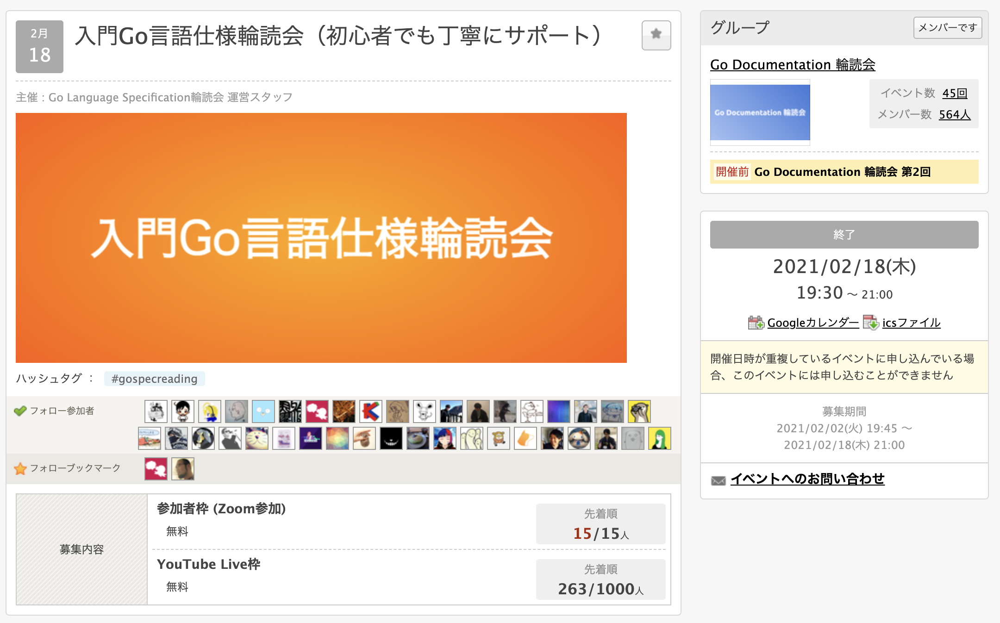
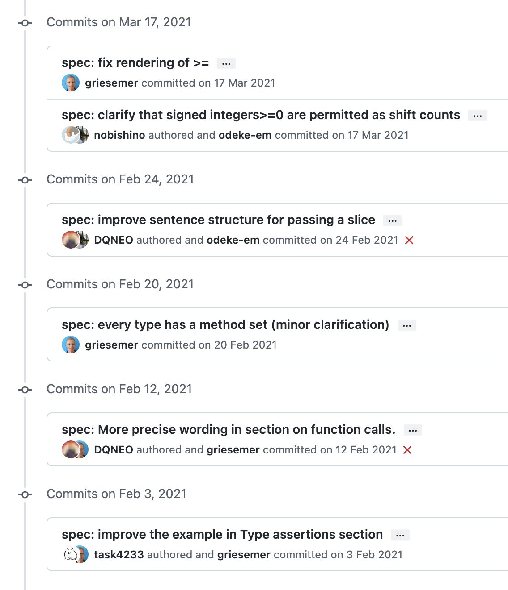
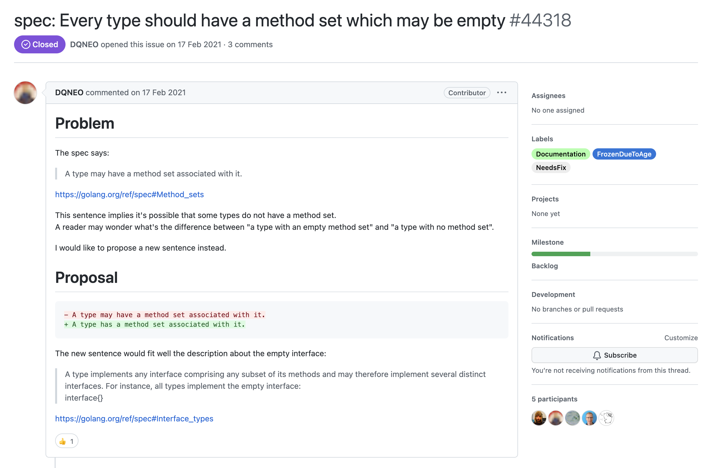
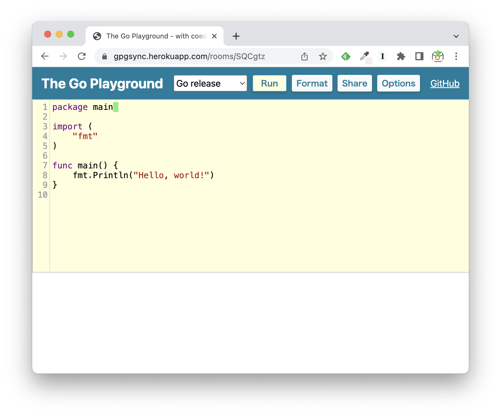
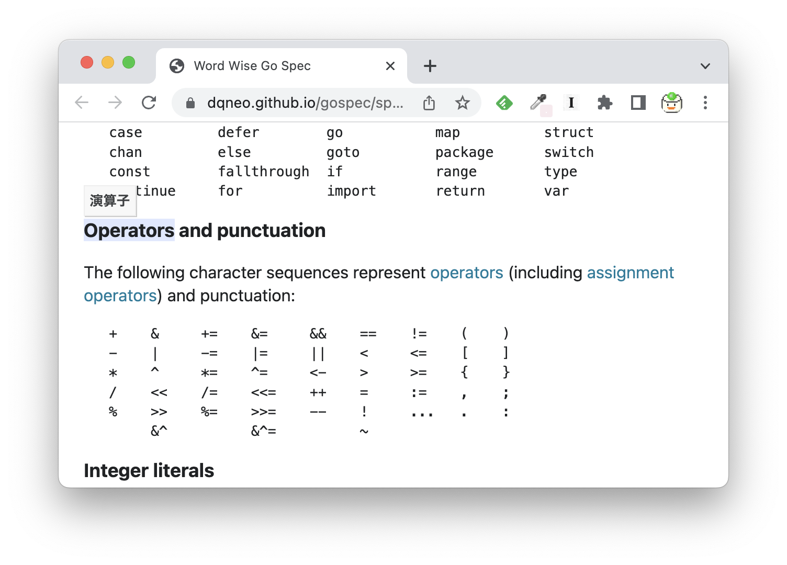

# Go言語仕様輪読会の開催を通じた振り返り

### syumai

#### Go Conference 2022 Spring (2022/4/23)

---

# 自己紹介

## syumai

* Go Documentation 輪読会 / ECMAScript 仕様輪読会 主催
* 株式会社ベースマキナ所属
* GoでGraphQLサーバー (gqlgen) や TypeScriptでフロントエンドを書いています

Twitter: [@__syumai](https://twitter.com/__syumai)
Website: https://syum.ai

---

# 話すこと

* Go Language Specification 輪読会について
* 活動のご紹介
* メンバーによる仕様への貢献のご紹介
* 勉強会に伴って開発したツールのご紹介
* うまくいった点、うまくいかなかった点

---

<!-- _class: lead -->

# Go Language Specification 輪読会について

---

## Go Language Specification 輪読会について

* Goの言語仕様を最初から最後まで読む勉強会
* 隔週水曜、19時から2時間半開催していた
* 2021年12月に最終回を開催しました

---

## 開催の動機

* 始めた当時、tenntennさん主催の静的解析勉強会に参加していた
* 言語仕様を読んだ方が理解が進むのでは？と思い、読みに行ったところ、思った以上に仕様のページが小さかった
  - 輪読できるのでは？とTwitterに投下すると思いの外反応があったので開催を決定

---
<!-- _class: lead -->

軽い気持ちで始めたものの…

かかった回数: <b>32回</b>

かかった期間: <b>1年5ヶ月</b>

---

<!-- _class: lead -->

# 活動のご紹介

---

## 活動のご紹介

* 輪読会本編
* 入門会
* 1.18+仕様輪読会

---

## 輪読会本編

* 上から順にひたすら仕様を読んでいく
  - https://go.dev/ref/spec
* 一文単位で、英語で読み日本語に翻訳する繰り返し
* 3~4文くらいで次の人に交代
* 事前準備無しで参加OK

---

## 入門会

* Goの言語仕様を読む上で重要な概念について紹介する会
  - defined type, underlying type, type identity etc...
* 本編の参加ハードルを下げるために企画
* 後々使える便利な資料が生まれました
  - DQNEOさんの [Underlying Type](https://speakerdeck.com/dqneo/go-language-underlying-type) など

* 全4回開催

---

多くの方に来ていただいて驚きました

---

## 1.18+仕様輪読会

* 当時リリース前のGo 1.18以降の仕様の差分を読む会
  - Genericsが中心
* 最新の仕様へのキャッチアップが進みました
  - 読んだばっかりの箇所が次の回には変更されてる！と言うパターンも多かった
* 全7回開催

---

<!-- _class: lead -->

# メンバーによる仕様への貢献のご紹介

---

## メンバーによる仕様への貢献のご紹介

* 輪読会中に見付けた"プルリクチャンス"などをメンバーが提案して取り込まれた例がいくつかありました
  - メンバーが自主的に見付けて出しているものもあります
* 勉強会メンバーに仕様への貢献者が複数人居るので、patchを送るハードルが下がりました
* Gophers Slack の #spec-improve-ja でこの辺りの話をしています

---

## Go 1.16 ~ Go 1.17の仕様に取り込まれた例

* task4233さん
* DQNEOさん
* Nobishiiさん

https://github.com/golang/go/commits/master/doc/go_spec.html

---

## 例: every type has a method set

* DQNEOさんの提案

---

<!-- _class: lead -->

# 勉強会に伴って開発したツールのご紹介

---

## 同時編集Go Playground

* その場でコードを書いて動かしたいケースが多かったので、同時編集出来るPlaygroundを作りました https://github.com/syumai/gpgsync
  - socket.io と CodeMirror で動いています

---

## 辞書付き言語仕様書

* DQNEOさん製。言語仕様書中の英単語にカーソルを乗せると日本語訳が表示される https://github.com/DQNEO/gospec
* 言語仕様書によく出てくる単語を中心に、翻訳が行われている
* Chrome拡張版もある https://github.com/syumai/go-docs-dictionary-extension

---

<!-- _class: lead -->

# うまくいった点、うまくいかなかった点

---

## うまくいかなかった点

* 新しいメンバーが増えにくかった
  - 終盤にかけて、要求する事前知識が増えたからか、新規メンバーが増えにくくなった
  - テーマ的に仕方なかったかも知れないが、入門会をもっとこまめにやっても良かったかも
  - アーカイブがあっても良かったかも

---

## うまくいかなかった点

* 前に読んだ内容忘れがち問題があった
  - 長期に渡って開催したので、読んだ箇所の記憶が抜け落ちることがあった
  - こまめに資料を残しておいても良かったかも

---

## うまくいった点

* 最後まで読み切れた
  - これを目標にしていたので達成できてよかった
* 開催ハードルを下げ、継続に成功した
  - イベントの定型化を徹底した
  - 開催に必要なのは、ほぼconnpassのページ作成のみ

---

## うまくいった点

* 入門会の開催、メンバーの仕様への貢献など、予想外の発展があった
* 読み始めたタイミングが良かった
  - Genericsで仕様理解の難易度が上がったので、その変更が入る前に読み始められて良かった

---

## 最後に

* Goの言語仕様は読もうと思ったら全部読み切れます！
* ぜひ皆さんも読んでみてください！
  - 読み方に迷ったら Gophers Slack の #go-doc-reading チャンネルに質問いただければ誰か答えてくれると思います！

---

## 宣伝

* 続編として **Go Documentation 輪読会** (#godocreading) を隔週水曜で開催しています
  - go.dev/docs 配下のドキュメントを中心に読む会になる予定
  - https://gospecreading.connpass.com/
* ぜひご参加ください！

---

<!-- _class: lead -->

# ご清聴ありがとうございました！
