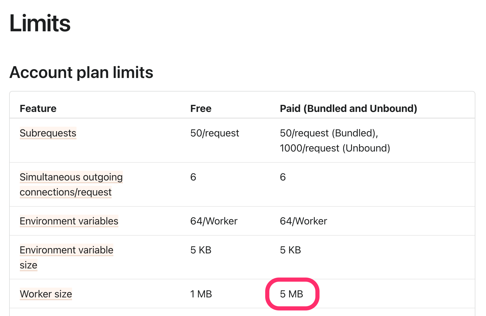
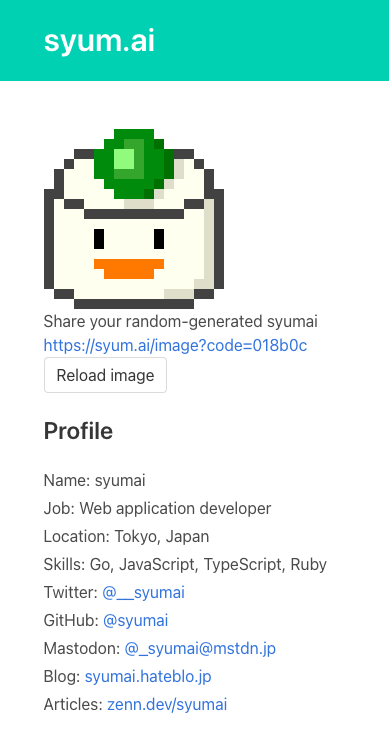
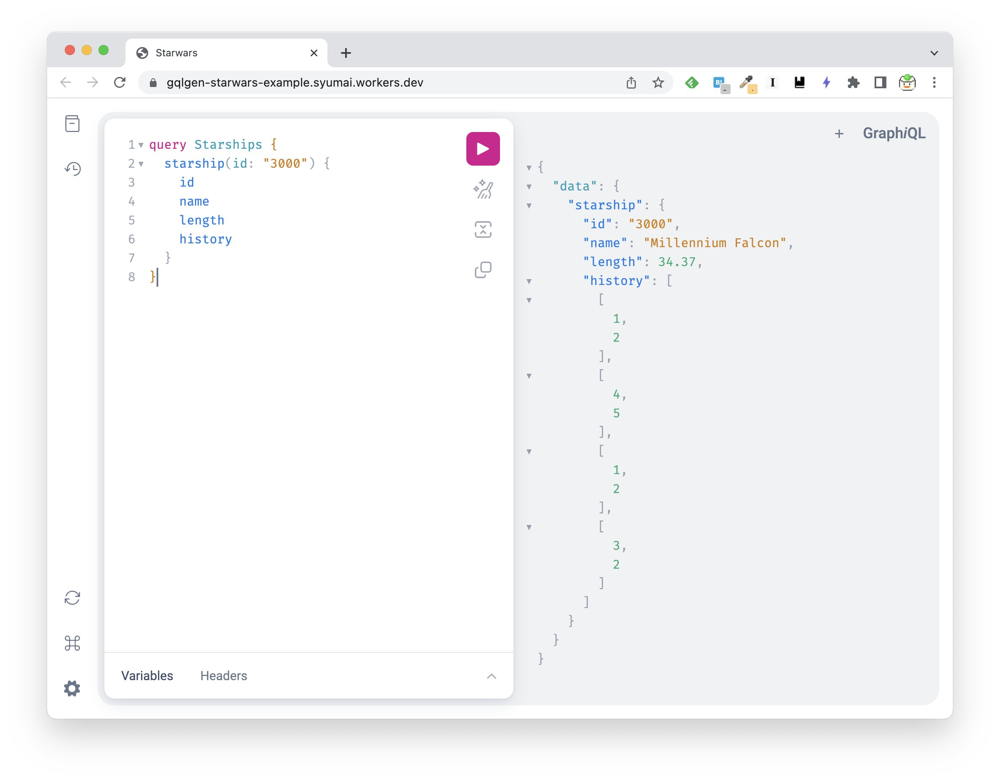
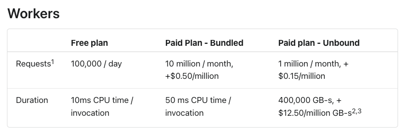
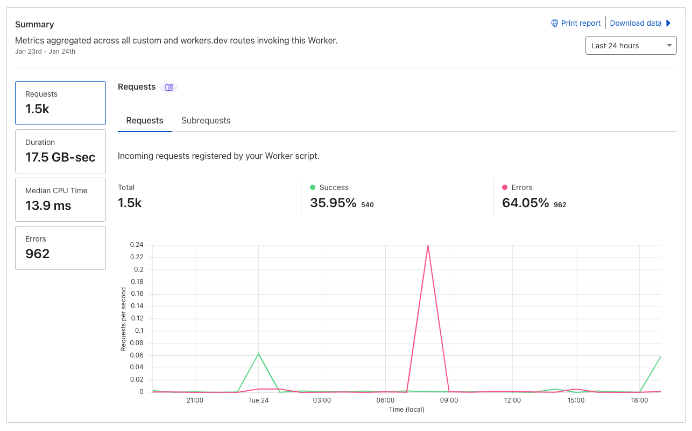
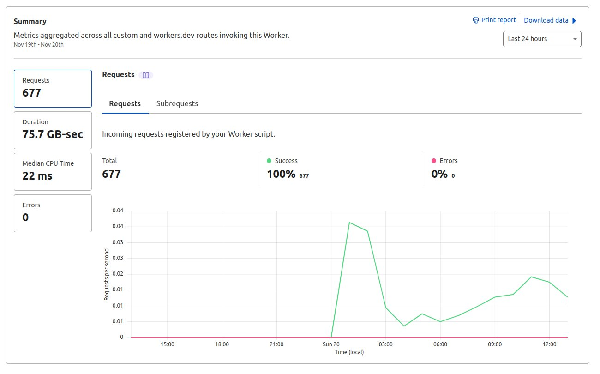

<style>
  section {
    font-family: "Helvetica Neue", Arial, "Hiragino Kaku Gothic ProN",
      "Hiragino Sans", Meiryo, sans-serif;
    padding: 50px;
  }
</style>

<style scoped>
  section {
    display: flex;
    flex-direction: column;
    justify-content: center;
  }
</style>

<base href="file:///Users/syumai/go/src/github.com/syumai/zenn/slides/">

# Cloudflare WorkersでGoを動かすライブラリを作っている話

### syumai

<!-- ####  -->

---


# 自己紹介

## syumai

* Go Documentation 輪読会 / ECMAScript 仕様輪読会 主催
* 株式会社ベースマキナで管理画面のSaaSを開発中
* GoでGraphQLサーバー (gqlgen) や TypeScriptでフロントエンドを書いています

Twitter: [@__syumai](https://twitter.com/__syumai)
Website: https://syum.ai

---

<!-- _class: lead -->

## syumai/workersとは

---

# syumai/workersとは

https://github.com/syumai/workers

* http.Handlerを作って、 `workers.Serve` に渡すだけでCloudflare Workers上でHTTPサーバーとして動作する
* 必要なツールは[tinygo](https://tinygo.org/)と[wrangler](https://developers.cloudflare.com/workers/wrangler/) (Cloudflare WorkersのCLI) だけ
  - tinygoを使ってWebAssemblyを生成して実行する

---

## workersを使ったコードのサンプル

普通に `http.HandlerFunc` を作るだけ

```go
func main() {
	handler := http.HandlerFunc(func(w http.ResponseWriter, req *http.Request) {
		name := req.URL.Query().Get("name")
		if name == "" {
			name = "world"
		}
		fmt.Fprintf(w, "Hello, %s!", name)
	})
	workers.Serve(handler)
}
```

<small>
https://hello.syumai.workers.dev/?name=syumai (=> Hello, syumai と表示) 
</small>

---


<!-- _class: lead -->

## Go on Cloudflare Workers で辛かった部分

---

## Workerのファイルサイズ制限

* [**圧縮後のサイズが1MB以内**](https://developers.cloudflare.com/workers/platform/limits/#worker-size)でないといけない制約があるため、バイナリサイズが大きくなる通常のGoではpublish出来ない
  - tinygoじゃないと無理
    - **でもtinygoはencoding/jsonすら動かなくてキツい**

---

<!-- _class: lead -->

## そこにCloudflare Workers有料プラン登場！

---

## 5MBのWorkerが作成可能に！



(料金は月$5。2022年11月から使えるようになった)

---

<!-- _class: lead -->

5MBのWorkerが作れると…、

<h3>tinygoじゃない普通のGoのWorkerが動く！</h3>

---

<!-- _class: lead -->

# 普通のGoで作ったWorkerの例

---

## syum.ai



* Go製のsyumaiのプロフィールページ
* グリーンピースの色をランダムに変化させて表示したりする
* もともとGoogle App Engineで動いていたものを、Cloudflare Workersに移管した
* https://syum.ai/

---

## gqlgen製のGraphQLサーバー



---

## gqlgen製のGraphQLサーバー

* gqlgen公式から拾ってきたSTAR WARS server
  - STAR WARS関連の情報をGraphQL経由で引っ張るAPI
* https://gqlgen-starwars-example.syumai.workers.dev/
* https://github.com/syumai/workers-playground/tree/main/gqlgen-starwars-example

---

## Cloudflare Workersの有料プランなら…

=> **実用的なGo製のWebアプリケーションが普通に動く！**

---

<!-- _class: lead -->

# パフォーマンスについて

---

## syum.aiのベンチマーク (heyで200req)

```
Summary:
  Total:	1.6804 secs
  Slowest:	1.4459 secs
  Fastest:	0.0234 secs
  Average:	0.2505 secs
  Requests/sec:	119.0185


Response time histogram:
  0.023 [1]	|
  0.166 [149]	|■■■■■■■■■■■■■■■■■■■■■■■■■■■■■■■■■■■■■■■■
  0.308 [1]	|
  0.450 [0]	|
  0.592 [0]	|
  0.735 [16]	|■■■■ <- 700ms以上かかっているリクエストが結構ある
  0.877 [22]	|■■■■■■
  1.019 [3]	|■
  1.161 [4]	|■
  1.304 [3]	|■
  1.446 [1]	|

Latency distribution:
  10% in 0.0329 secs
  25% in 0.0558 secs
  50% in 0.0741 secs
  75% in 0.1660 secs
  90% in 0.7640 secs <- 90 percentileで約760ms
  95% in 0.9667 secs
  99% in 1.2275 secs
```

---

## syum.aiのベンチマーク

* GoのWorkerは0ms cold startの限界を超えていそう
  - 700ms以上かかっているリクエストは、Workerのロードが追いついていない感じがする
    - (Wasmのサイズは、未圧縮で5.6MB)
* とは言え、75 percentileで約170msなので、実用的なスピードは出てはいる

---

<!-- _class: lead -->

# Bundled / Unbound どちらを使うか？

---

## Bundled / Unboundのプラン内容



* Bundled: 50ms CPU time / invocation
* Unbound: 400,000 GB-s
* https://developers.cloudflare.com/workers/platform/pricing/

---

* syum.ai (Bundled) の直近の Error rate は64% ...
  - 50ms CPU timeに収まっていない様子



---

* (少し前ですが) gqlgen-example (Unbound) の Error rate は0%



---

## Bundled / Unbound どちらを使うか？

* 料金的には、Bundledのプランが月$5で1000万リクエストを捌けるので、こちらの方が魅力的
  - Unboundだと同じ料金で100万リクエストで、使用メモリ量に対する課金も生まれる
* ただ、50ms CPU timeに収まらないので、**GoのWorkerはUnbound必須と言えそう**…。

---

<!-- _class: lead -->

# 今後の展望

---

## Cloudflare D1 サポート

* Cloudflare D1 の sql/driver を実装中
  - GoだけでCloudflare Worker上でもっと実用的なアプリケーションを作れるようにしたいです！
  - https://github.com/syumai/workers/pull/18

---

## おまけ

tinygoとGoのtemplateを用意しているのでぜひ使ってみてください！

* https://github.com/syumai/worker-template-tinygo
* https://github.com/syumai/worker-template-go

実装の解説はZennに掲載しています！
* [Cloudflare Workersで簡単にGoのHTTPサーバーを動かすためのライブラリを作った](https://zenn.dev/syumai/articles/ca9n4e91eqljc44k6ebg)

---

<!-- _class: lead -->

## ご清聴ありがとうございました！
