

# ECMAScript仕様を読むのに必要な知識 - ダイジェスト版

### syumai

#### フロントエンドカンファレンス北海道2024 (2024/8/23)

---

# 自己紹介

## syumai

- ECMAScript 仕様輪読会 主催
- 株式会社ベースマキナで管理画面のSaaSを開発中
  - GoでGraphQLサーバー (gqlgen) や TypeScriptでフロントエンドを書いています
- Software Design 12月号からCloudflare Workersの連載をしてます

Twitter: [@__syumai](https://twitter.com/__syumai)
Website: https://syum.ai

---

---

# 本日話すこと

- ECMAScript仕様を読むのに必要な知識について、5分でなるべく多く話します
- 全部を網羅するのは無理なので、特にハマりやすいものについて紹介します
- [Meguro.es #26 での発表](https://speakerdeck.com/syumai/how-to-read-ecmascript-spec)と被りがありますがご容赦ください

---

<!-- _class: lead -->

# ECMAScript仕様書

---

## ECMAScript仕様書

* Ecma Internationalのサイトから、PDFまたはHTMLで閲覧可能
  - https://ecma-international.org/publications-and-standards/standards/ecma-262/
  - 現在の最新はECMAScript 2024 (第15版)
  - 版が切られる前の最新のドラフトも閲覧可能
    - https://tc39.es/ecma262/

---

<!-- _class: lead -->

# 仕様を読むのに必要な知識

---

## 仕様を読むのに必要な知識

ECMAScript仕様書を読み始めるには、以下を知っておく必要がある

* 表記法
  - 文法の表記法
  - アルゴリズムの表記法 ← 今日話すのはここまで
* ECMAScript仕様上のみ登場する型

↑ を理解していないと、ひたすら理解不能な内容が続く

---

  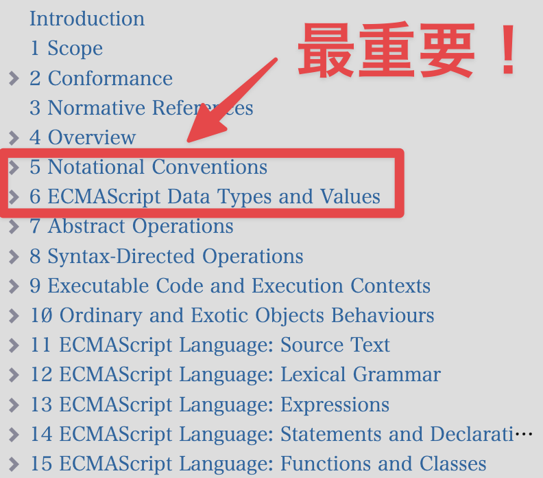
  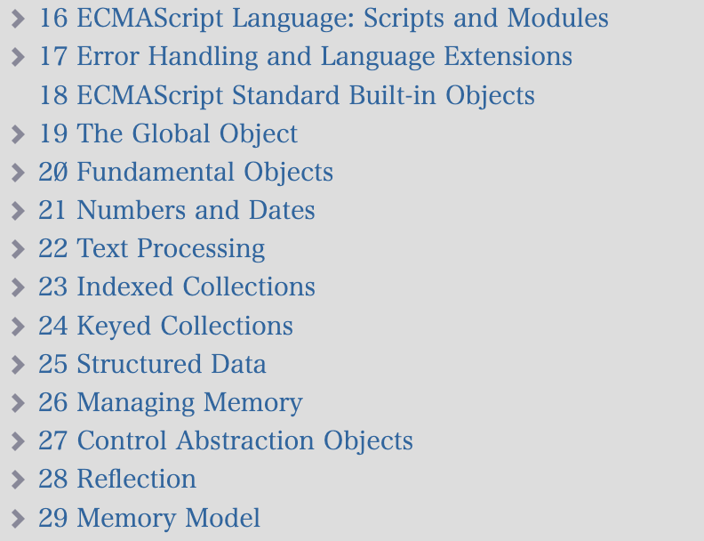

---

<!-- _class: lead -->

# 表記法

---

## 表記法

* `5. Notational Conventions` (表記規則) で示されています

---

<!-- _class: lead -->

# 文法の表記法

---

## 文法の表記法

* 文法は、文脈自由文法で表現される
* `Syntax` に記載される *斜体文字* は[非終端記号](https://262.ecma-international.org/15.0/#sec-nonterminal-symbols-and-productions)
  - 下記スクショでは *RelationalExpression* など
* `:` や `::` などは非終端記号の定義 (文法生成規則とも言う)
  - 左辺の非終端記号を構成するトークン列が `:` や `::` などの右辺に示される
    - 右辺のトークン列には、非終端記号および終端記号が並ぶ
  - 構文的文法 (Syntactic Grammar) を示す `:` が最も頻出する

  

---

## 文法の表記法

* 等幅フォントの文字は[終端記号](https://262.ecma-international.org/15.0/#sec-terminal-symbols)
  - 下記スクショでは `<`
* 終端記号は、非終端記号と異なり、記載された通りにソースコード中に現れる
  - 非終端記号は最終的にこれらの記号に辿り着くため、終端記号と呼ばれる

  

---

## 文法生成規則の省略記法1: 縦に並べる

* 左辺の非終端記号が同一となる生成規則が複数並ぶ場合、縦に並べて記載される
  - 繰り返し同じ記載をするのを避けるための省略記法
    - 共通した左辺を持つ複数の生成規則を指して代替 (alternatives) とも言う

### 例

  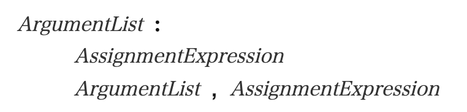

これは以下2つの生成規則の省略記法

* *ArgumentList* : *AssigmentExpression*
* *ArgumentList* : *ArgumentList* , *AssignmentExpression*

---

## 文法生成規則の省略記法2: optional

* `opt` と言うsuffixは、 `opt` の付いているトークンが存在する生成規則と、存在しない生成規則の2つの省略記法

### 例

  

これは以下2つの生成規則の省略記法

* *VariableDeclaration* : *BindingIdentifier* *Initializer*
* *VariableDeclaration* : *BindingIdentifier*

---

## 文法生成規則の省略記法3: 文法的パラメータ

* 省略記法シリーズの中では一番ややこしい
* `[ParameterName]` がsuffixに付いた**左辺側の非終端記号**は、その文法的パラメータ (Grammatical Parameters) の名前がsuffixに付いた生成規則と、付いていない生成規則の2つの省略記法

### 例

  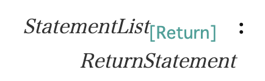

これは以下2つの生成規則の省略記法

* *StatementList* : *ReturnStatement*
* *StatementList_Return* : *ReturnStatement*

---

## 文法生成規則の省略記法3: 文法的パラメータ

* 文法的パラメータが複数ある時は、全てをかけ合わせた種類分の省略記法になる

### 例

  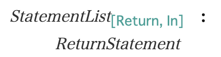

これは以下4つの生成規則の省略記法

* *StatementList* : *ReturnStatement*
* *StatementList_Return* : *ReturnStatement*
* *StatementList_In* : *ReturnStatement*
* *StatementList_Return_In* : *ReturnStatement*

---

## 文法生成規則の省略記法3: 文法的パラメータ

* 文法的パラメータを持つ**右辺側の非終端記号**に対して、引数を明示することが出来る
  - `[Yield, Await]` で超頻出 (awaitが利用可能な文脈のみで有効な識別子など)

### 例

下記の `[In]` パラメータを持つ生成規則があると仮定して、引数の渡し方の例を示します

  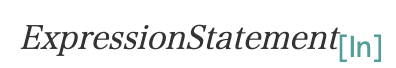

生成規則は2つ

* *ExpresssionStatement* : (右辺は省略)
* *ExpresssionStatement_In* : (右辺は省略)

---

## 文法生成規則の省略記法3: 文法的パラメータ

* `[+ParameterName]` は、その引数があるパターンのみを使うことを指示する記法

### 例

  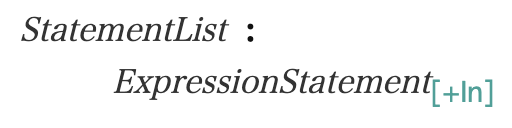

これは以下の生成規則1つを表す

* *StatementList* : *ExpressionStatement_In*

---

## 文法生成規則の省略記法3: 文法的パラメータ

* `[~ParameterName]` は、その引数が無いパターンのみを使うことを指示する記法

### 例

  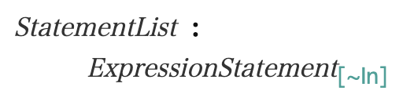

これは以下の生成規則1つを表す

* *StatementList* : *ExpressionStatement*

---

## 文法生成規則の省略記法3: 文法的パラメータ

* `[?ParameterName]` は、左辺の非終端記号が持つ文法的パラメータに受け取った引数と同じパターンをそれぞれ使うことを指示する記法

### 例

  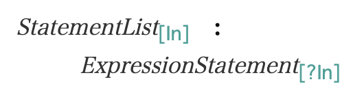

これは以下の生成規則2つの省略記法

* *StatementList* : *ExpressionStatement*
* *StatementList_In* : *ExpressionStatement_In*

---

<!-- _class: lead -->

# アルゴリズムの表記法

---

## アルゴリズムの表記

* ECMAScriptの仕様内で記述されるアルゴリズムは、主に下記の2種類の操作を通じて呼び出される。
  - Abstract Operation (抽象操作)
  - Syntax-Directed Operation (構文指向操作)

---

## Abstract Operation

* **Abstract Operation**は `Operation(arg1, arg2)` といった関数的なスタイルで、**値**を受け取ってアルゴリズムを処理する。

### 例

  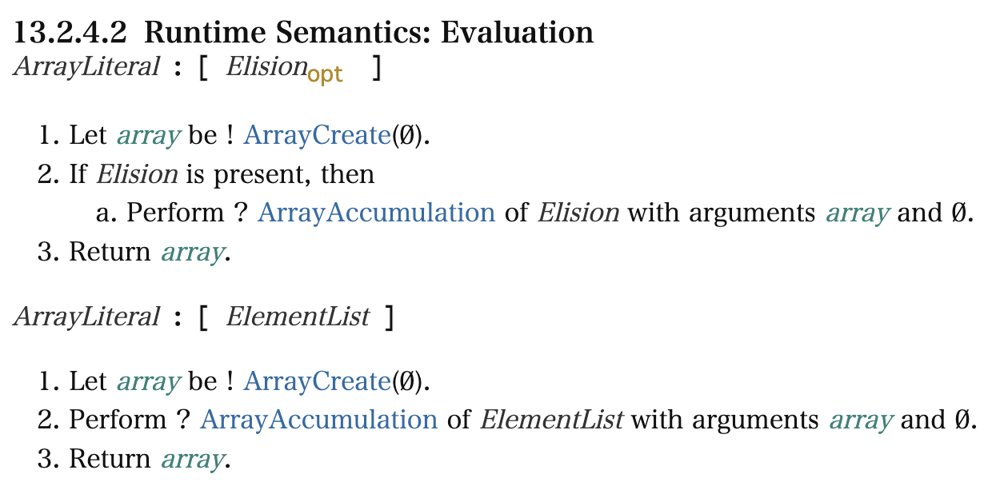

---

## Syntax-Directed Operation

* **Syntax-Directed Operation**は `Operation` of `Syntax` のスタイルで、**文法生成規則**を受け取ってアルゴリズムを処理する。
  - 文法生成規則に複数の代替 (alternatives) が存在する場合、それぞれに対するアルゴリズムが定義される

---

## Syntax-Directed Operation の定義の例

  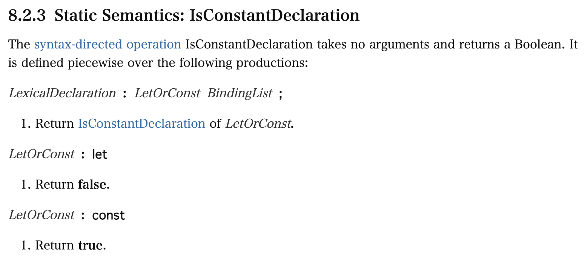

---

## Syntax-Directed Operation の利用例

* 14.7.4.2 Runtime Semantics: ForLoopEvaluation より抜粋

  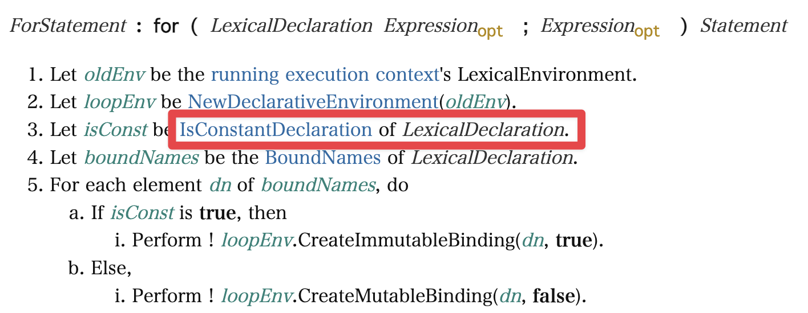

---

## セマンティクス

ECMAScriptでは、以下の2種類で定義されている

* [Runtime Semantics](https://262.ecma-international.org/15.0/#sec-runtime-semantics)
  - 文法生成規則に対応する形で、実行時 (runtime) のセマンティクスを示すアルゴリズム列
* [Static Semantics](https://262.ecma-international.org/15.0/#sec-static-semantic-rules)
  - 文脈自由文法だけでは入力列が有効か判断できないようなケースなどで使う
    - (※補足: `5.2.4 Static Semantics` で明確に説明されていないように思われますが、文脈自由文法で表現できるようなケースについても、静的にセマンティクスが決まるものはStatic Semanticsに分類されているように見えます)
  - アルゴリズム列か、散文的な記法で示される

---

## Runtime Semanticsの例

* *ArrayLiteral* の文法生成規則に対応するRuntime Semantics (抜粋)
  - それぞれの文法生成規則に対応するアルゴリズムが存在する

  

---

## Static Semanticsの例 (アルゴリズム列)

* 一般的なStatic Semanticsは、アルゴリズム列でセマンティクスを定義している

  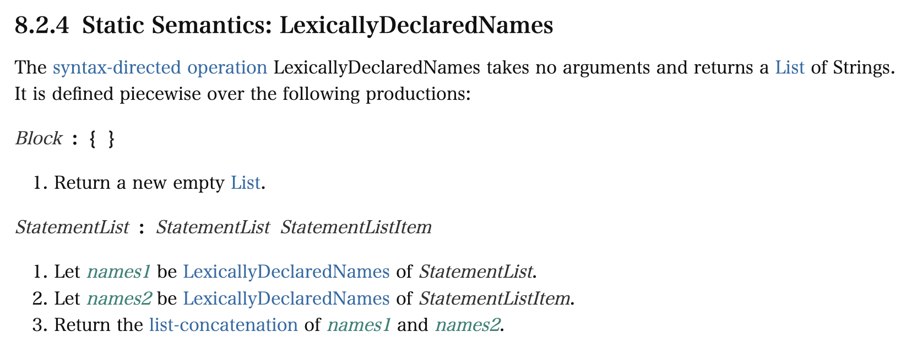

---

## Static Semanticsの例 (散文的な記法)

* **Early Errors**と言う特殊な種類のStatic Semanticsは、散文的な記法 (ここでは箇条書き) でセマンティクスが定義されている
  - ここでは `"let"` と言う名前の識別子をlet / constの宣言に含められない、など
  - Runtime Semanticsに進む前のバリデーション的に使われる

  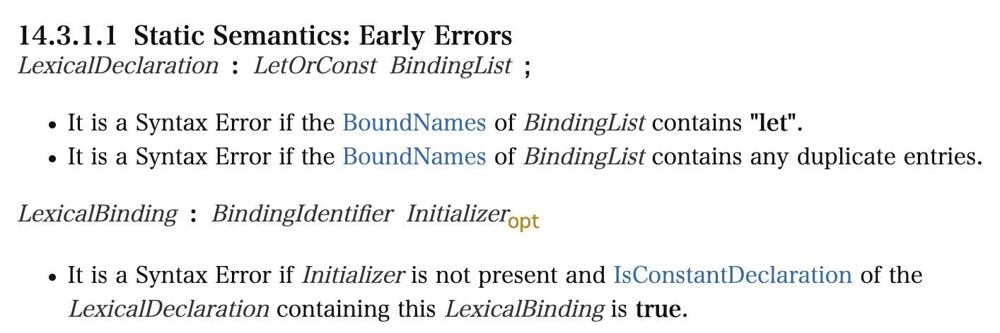

---

## Completion Record

* Completion Recordは、プログラム上の制御フローおよび、それに伴う値を伝播する役割を持っているECMAScript仕様上のみの型
  - 制御フローの例: `break, continue, return, throw`
* Completion Recordは大きく2種類に分けられる
  - normal completion
    - Completion Recordの `[[Type]]` が `NORMAL` のもの
    - 正常終了を表す
  - abrupt completion
    - Completion Recordの `[[Type]]` が `NORMAL` 以外のもの
      - `BREAK, CONTINUE, RETURN, THROW`
    - 実際にabrupt completionを使うアルゴリズムが登場する時、その内容はほとんどが `THROW` のパターン (TypeErrorのthrowなど)

---

## ReturnIfAbrupt

* 呼び出したAbstract OperationやSyntax-Directed OperationがAbrupt Completionを返した時に、Early returnする操作

  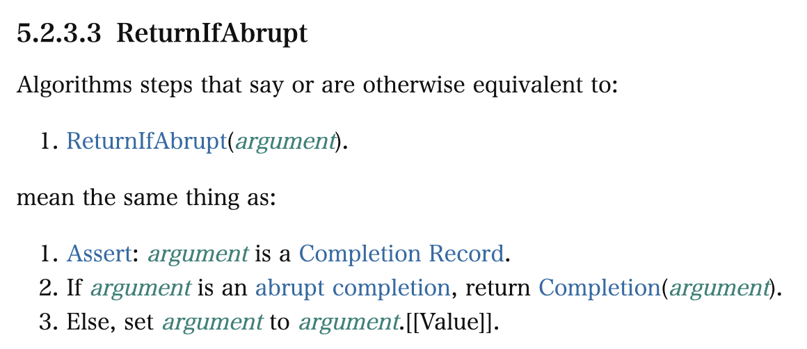

---

## ReturnIfAbruptの省略表記

* 操作の呼び出しの前に置かれている `?` はReturnIfAbruptの省略表記
  - 大体の場合、「**この操作はErrorを投げる可能性があり、Errorが投げられたらそこで終了する**」と読むので問題ない
* 代わりに `!` が置かれていたら、呼び出し対象の操作がAbrupt Completionを返す可能性があるが、ここでは絶対に返すことがないと言うAssertionになる

  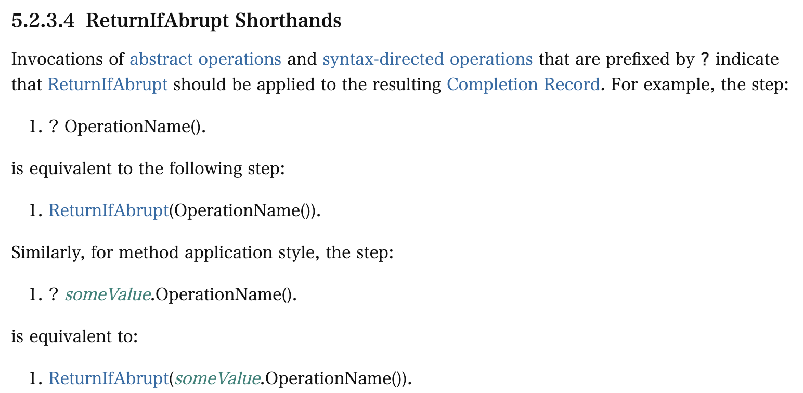

---

## さいごに

* 実はこれでもまだ全然紹介しきれていない
* とりあえず最初の一歩を踏み出せれば芋づる式に読み方がわかってくる
* みなさんもぜひECMAScriptの仕様を読んでみましょう！

---

## 宣伝

* ECMAScriptの仕様を読むのに興味が出た方は、ぜひECMAScript仕様輪読会にお越しください！
  - 2週に1回、火曜に開催しています
  - https://esspec.connpass.com/

---

<!-- _class: lead -->

## ご清聴ありがとうございました！
