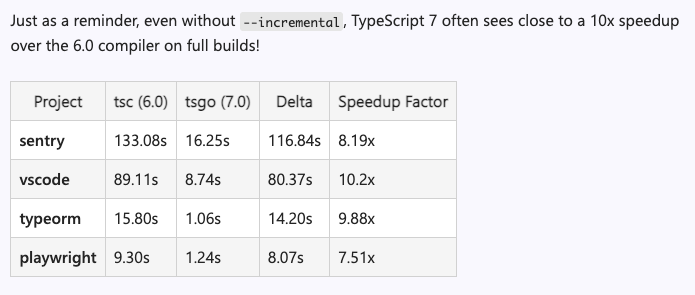
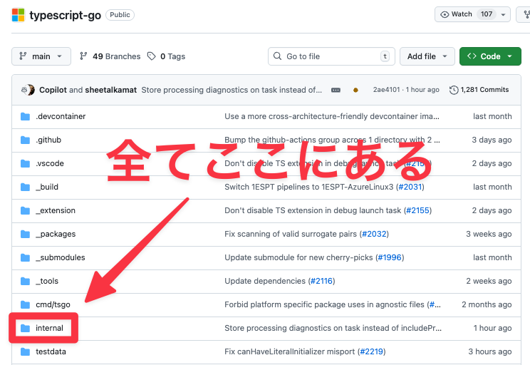
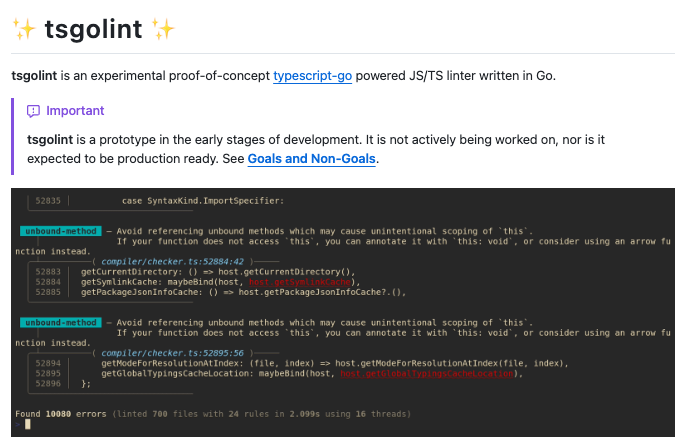

<style scoped>
  h1 {
    font-size: 60px;
  }

  h2 {
    font-size: 42px;
  }
</style>


<!-- _class: lead -->

# tsgolintはいかにしてtypescript-goの<br/>非公開APIを呼び出しているのか

## syumai

## layerx.go #3 (2025/12/5)

---


# 自己紹介

## syumai

- LayerX所属 ソフトウェアエンジニア
- ECMAScript 仕様輪読会 / Asakusa.go 主催
- Software Design 2023年12月号から2025年2月号までCloudflare Workersの連載をしました

Twitter (現𝕏): [@__syumai](https://twitter.com/__syumai)
Website: https://syum.ai

---

# 本日話すこと

* typescript-go (tsgo) とは
* tsgolintとは
* tsgolintからtsgoの非公開APIへのアクセス方法

---

<!-- _class: lead -->

# typescript-go (tsgo) とは

---

## typescript-go (tsgo) とは

* TypeScriptのGo実装
  - もともと**TypeScript自身がTypeScriptで実装されている**
    - 型チェック、トランスパイルなどのロジックを持つ
    - `tsc` コマンドを通して処理が行われる
    - 処理の実行はJSにトランスパイルされた上でNode.js上などで行われる
* [`microsoft/typescript-go`](https://github.com/microsoft/typescript-go) リポジトリでは、TypeScriptのコアのロジックを**Goで再実装している**
  - `tsc` コマンドを置き換える **`tsgo`** コマンドを提供
* TypeScript 7 としてリリース予定

---

<!-- _class: lead -->
<div>

</div>

2025年3月に発表、界隈がざわついた

https://devblogs.microsoft.com/typescript/typescript-native-port/

---

<!-- _class: lead -->
<div>

</div>

2025年12月に進捗報告があり、かなり安定してきているらしい

https://devblogs.microsoft.com/typescript/typescript-native-port/

---

## tsgoの特徴

* **とにかく速い**
  - tscの10倍の速度でビルドが完了することもあるらしい

<div>

</div>

---

## tsgoの特徴

* **高い互換性**
  - 巨大な型チェックのロジックを持つ `checker.ts` を行単位でGoにポート
    - `checker.ts` は5万行ほどのサイズ
    - 巨大すぎて、再設計しての実装は現実的ではない
  - Goが選ばれた理由は、文法的にそのまま移植しやすかったかららしい

---

## tsgoの特徴

* **ロジックをライブラリ提供しない**
  - 型チェックなどのロジックを、tsgoコマンド経由でしか提供しない
  - **実装は、全部 `internal` package配下にあり、ライブラリ提供を想定しない**
  - Launguage Serverや標準出力を使ったIPCベースのAPIサーバーは提供する
    - IPCの仕様はまだ決まってなさそう

---

<div style="text-align: center">

</div>

---

<!-- _class: lead -->

# tsgolintとは

---

<div style="text-align: center">

</div>

---

## tsgolintとは

* 2025年7月に、typescript-eslintのチームがリリースしたtsgoベースのLinter
  - https://github.com/typescript-eslint/tsgolint
* 実装は全部Go
* ESLint + typescript-eslintより**20 ~ 40倍速い**らしい
* **tsgoのinternal packageの中身を無理矢理公開して使っている**
* あくまで**実験的なプロジェクト**で、typescript-eslintの置き換えを意図しない

---

## tsgolintを取り巻く状況

* typescript-eslintのチームはもうメンテしていない
* **oxcのチームがforkし、oxlintのtype-aware lintingに使っている**
  - こっちはかなりアクティブにメンテされている
  - https://github.com/oxc-project/tsgolint

---

<!-- _class: lead -->

# tsgolintからのtsgoの非公開API呼び出し方法

---

## tsgolintからのtsgoの非公開API呼び出し方法

* 注: まだ調べ途中なので、不正確な情報があるかもしれません

---

<!-- _class: lead -->

# その1: git submoduleによるtypescript-goの設置

---

## その1: git submoduleによるtypescript-goの設置

* git submoduleで `typescript-go` のリポジトリを丸ごと `tsgolint` リポジトリ直下に置いている
  - `go get` しないことで自由度を上げている (コード生成、パッチ当てなど)
  - submoduleを明示的に更新しないと壊れない
    - (Go Modulesで管理するとうっかり上がることがあるかもしれない?)

```console
.
├── cmd
│   └── tsgolint
├── go.mod
├── go.sum
├── go.work
├── go.work.sum
├── internal
├── README.md
└── typescript-go
```

---

## Workspaceでtypescript-go moduleを追加

* `go.work` で `typescript-go` ディレクトリを指定
  - `github.com/microsoft/typescript-go` moduleが相対パスで取得可能に

```toml
go 1.24.1

use (
	.
	./typescript-go
)
```

---

<!-- _class: lead -->

# その2: `go:linkname`

---

## `internal` packageにlinkするための `shim` package

* `tsgolint` 直下に `shim` packageを設置
* 中身は `typescript-go` の `internal` package配下に対応
* 公開したいものがここに置かれる

```
./shim
├── ast
├── bundled
├── checker
├── compiler
├── core
├── scanner
├── tsoptions
├── tspath
└── vfs
```

---

## shimファイルの中身 (例)

* 例は `shim/ast/shim.go`
* internalな型をそのままexportしている

```go
// Code generated by tools/gen_shims. DO NOT EDIT.

package ast

import "github.com/microsoft/typescript-go/internal/ast"

/* 中略 */

type AccessExpression = ast.AccessExpression
type AccessorDeclaration = ast.AccessorDeclaration
```

---

## shimファイルの中身 (例)

* 同じく `shim/ast/shim.go` の例
* 関数はbody無しで、 **`go:linkname` でlinkしてexportしている**
* `github.com/microsoft/typescript-go/shim/ast/shim/ast.CanHaveDecorators` を呼んだら、
  `github.com/microsoft/typescript-go/internal/ast.CanHaveDecorators` のロジックが呼ばれる構造

```go
//go:linkname CanHaveDecorators github.com/microsoft/typescript-go/internal/ast.CanHaveDecorators
func CanHaveDecorators(node *ast.Node) bool
//go:linkname CanHaveIllegalDecorators github.com/microsoft/typescript-go/internal/ast.CanHaveIllegalDecorators
func CanHaveIllegalDecorators(node *ast.Node) bool
//go:linkname CanHaveIllegalModifiers github.com/microsoft/typescript-go/internal/ast.CanHaveIllegalModifiers
func CanHaveIllegalModifiers(node *ast.Node) bool
//go:linkname CanHaveModifiers github.com/microsoft/typescript-go/internal/ast.CanHaveModifiers
func CanHaveModifiers(node *ast.Node) bool
```

---

## shimファイルの中身 (例)

* `shim/checker/shim.go` の例
* 非公開メソッドも `go:linkname` を駆使して公開している

```go
type Checker = checker.Checker
//go:linkname Checker_getResolvedSignature
  github.com/microsoft/typescript-go/internal/checker.(*Checker).getResolvedSignature
func Checker_getResolvedSignature(recv *checker.Checker, node *ast.Node,
  candidatesOutArray *[]*checker.Signature, checkMode checker.CheckMode) *checker.Signature
//go:linkname Checker_getTypeOfSymbol
  github.com/microsoft/typescript-go/internal/checker.(*Checker).getTypeOfSymbol
func Checker_getTypeOfSymbol(recv *checker.Checker, symbol *ast.Symbol) *checker.Type
```

わかりやすさのために改行していますが、実際は改行なしです

---

## `go:linkname` って非推奨じゃなかった？

* Goのランタイムへの `go:linkname` が封じられただけで、**サードパーティーのmoduleに対しては普通に使える**
  - `runtime` packageなどへの `go:linkname` はNG
  - `github.com/microsoft/typescript-go` への `go:linkname` は何も問題ない
* 詳しい経緯はANDPADさんの「Go界隈で巻き起こった go:linkname 騒動について」を参照ください
  - https://tech.andpad.co.jp/entry/2024/06/20/140000

---

## 実際の呼び出し例

<small>

* `internal/rules/no_confusing_void_expression/no_confusing_void_expression.go`
* shimが無いと呼び出せない機能でlintルールを実装

</small>

```go
package no_confusing_void_expression

import (
	"github.com/microsoft/typescript-go/shim/ast"
	"github.com/microsoft/typescript-go/shim/checker"
	"github.com/microsoft/typescript-go/shim/scanner"
	"github.com/typescript-eslint/tsgolint/internal/rule"
	"github.com/typescript-eslint/tsgolint/internal/utils"
)

/* 中略 */

return utils.Some(callSignatures, func(s *checker.Signature) bool {
  returnType := checker.Checker_getReturnTypeOfSignature(ctx.TypeChecker, s)
  return utils.Some(utils.UnionTypeParts(returnType), utils.IsIntrinsicVoidType)
})
```


---

<!-- _class: lead -->

# その3: Go Moduleのreplaceで `shim` を `typescript-go` の中に入れる

---

## Go Moduleのreplaceで `shim` を `typescript-go` の中に入れる

* `go.mod` の例

```toml
module github.com/typescript-eslint/tsgolint

go 1.24.1

replace (
	github.com/microsoft/typescript-go/shim/ast => ./shim/ast
	github.com/microsoft/typescript-go/shim/bundled => ./shim/bundled
	github.com/microsoft/typescript-go/shim/checker => ./shim/checker
	github.com/microsoft/typescript-go/shim/compiler => ./shim/compiler
	github.com/microsoft/typescript-go/shim/core => ./shim/core
	github.com/microsoft/typescript-go/shim/scanner => ./shim/scanner
	github.com/microsoft/typescript-go/shim/tsoptions => ./shim/tsoptions
	github.com/microsoft/typescript-go/shim/tspath => ./shim/tspath
	github.com/microsoft/typescript-go/shim/vfs => ./shim/vfs
	github.com/microsoft/typescript-go/shim/vfs/cachedvfs => ./shim/vfs/cachedvfs
	github.com/microsoft/typescript-go/shim/vfs/osvfs => ./shim/vfs/osvfs
)
```

---

## なぜ `shim` を　`typescript-go` に入れる必要があるのか？

* 恐らく **`internal` package配下の型情報をexportするのが主目的**
  - `shim` が `typescript-go` 内なので `typescript-go` の `internal` が見える
  - `go:linkname` での関数の公開にも、引数・戻り値の型情報は必要
* さっきの `shim/ast/shim.go` の例

```go
// Code generated by tools/gen_shims. DO NOT EDIT.

package ast

import "github.com/microsoft/typescript-go/internal/ast"

/* 中略 */

type AccessExpression = ast.AccessExpression
type AccessorDeclaration = ast.AccessorDeclaration
```

---

<!-- _class: lead -->

# その4: `shim` の生成

---

## `shim` の生成

* `tools/gen_shims` で実装されている
  - ASTを解析して、`internal` package配下で公開の型・関数を自動で `shim` にexport
  - 非公開のメソッド、関数などのexportに使える `extra-shim.json` という設定ファイルもある
* **手間のかかるexportの作業を全自動化している**
* 実装の詳細は見れてないです 🙏

---

## その他のテクニック

* `unsafe.Pointer` を駆使して構造体の非公開フィールドを公開してそう
* やむを得ずtypescript-go本体にパッチを当ててる部分もある様子
  - `patches` ディレクトリに入っている

---

## まとめ

* tsgolintは、あらゆる方法を駆使してtypescript-goの非公開APIを公開している
  - `go:linkname`
  - Go Modulesのreplace
  - shimの自動生成
* どうしても、外部のGo製ライブラリの非公開APIを使いたくなってしまった時に参考になるかも
  - **どう考えても壊れやすい仕組みではある**ので、**覚悟を決めないと難しそう**な印象

---

<!-- _class: lead -->

# ご清聴ありがとうございました！